[TOC]

# 一、Alpha 开发板资源介绍
## 1.1 底板资源介绍
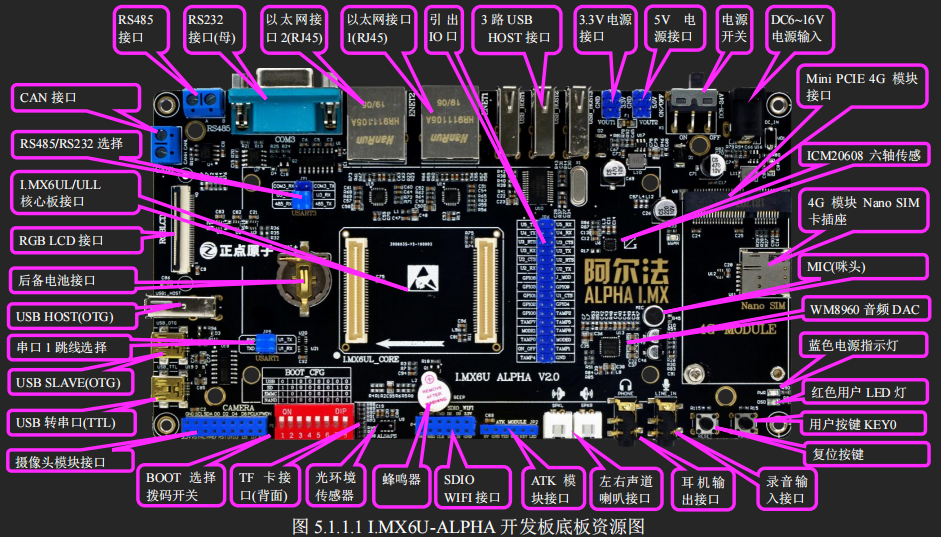
|  资源  | 参数 |  描述   |
| ----- | ---- | ------ |  
| CPU   | 主频 800MHz(实际为 792MHz) BGA289 | MCIMX6Y2CVM08AB     |

## 1.2 核心板资源介绍
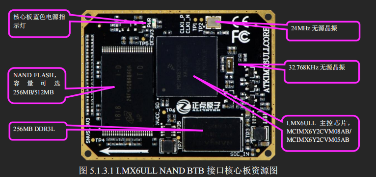
|  资源  | 参数 |  描述   |
| ----- | ---- | ------ |  
| CPU   | 主频 800MHz(实际为 792MHz) BGA289 | MCIMX6Y2CVM08AB     |
| DDR3L | 大小 256MB 字节                   | NT5CC128M16JR-EK    |
| NAND Flash | 大小 512MB 字节        | MT29F4G08ABADAWP-IT |

# 二、原理图
[底板原理图文件](../docs/IMX6ULL_ALPHA_V2.2(底板原理图).pdf)
[核心板原理图文件](../docs/IMX6ULL_CORE_V2.0(核心板原理图).pdf)
## 2.1 底板原理图
### 2.1.1 转接板原理图
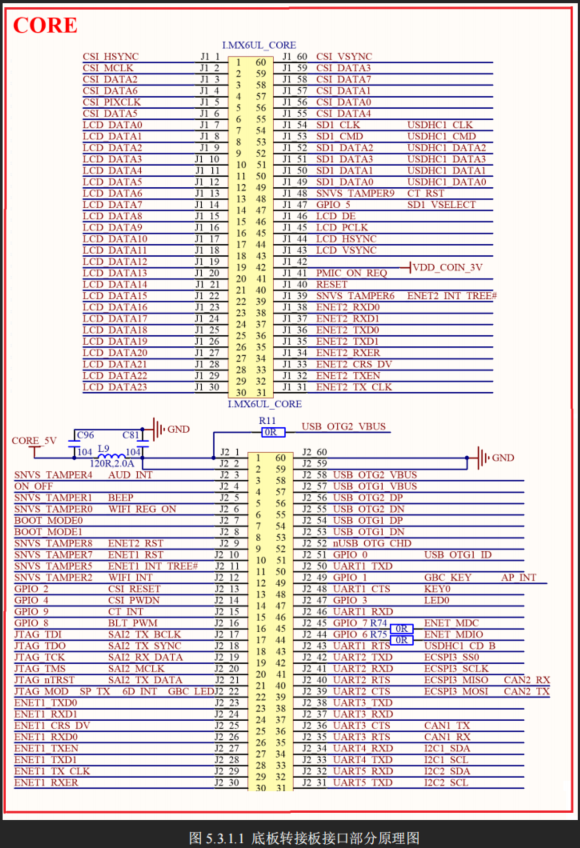

### 2.1.2 JP6引出引脚原理图
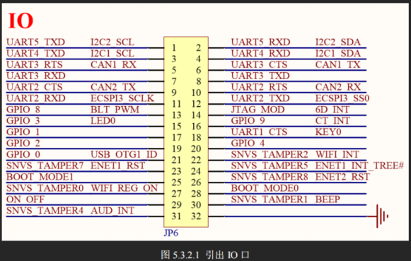

### 2.1.3 JP5串口1原理图
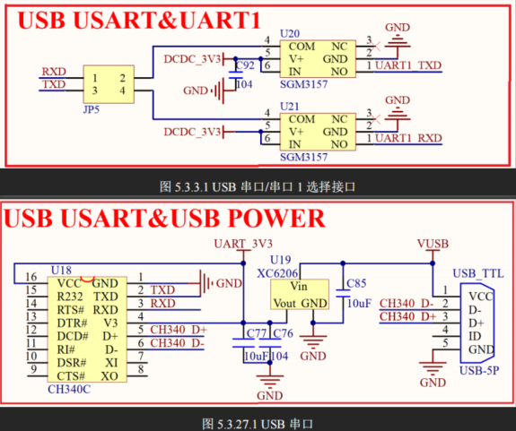

### 2.1.4 RGB888LCD原理图
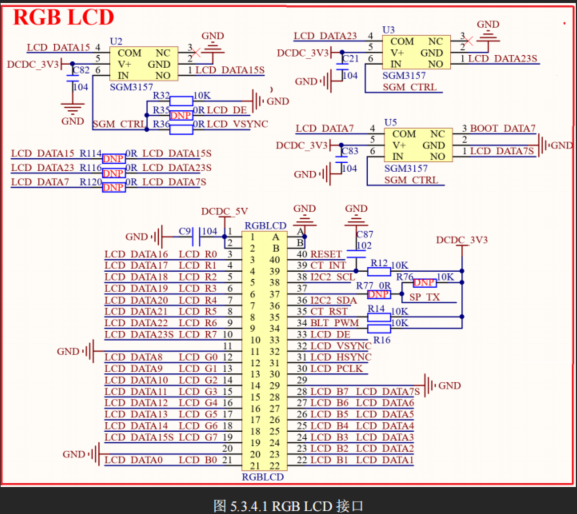

### 2.1.5 BOOT-CFG原理图
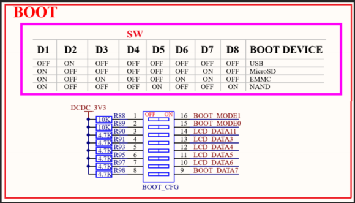

### 2.1.6 JP1串口U3-RS232-RS485原理图
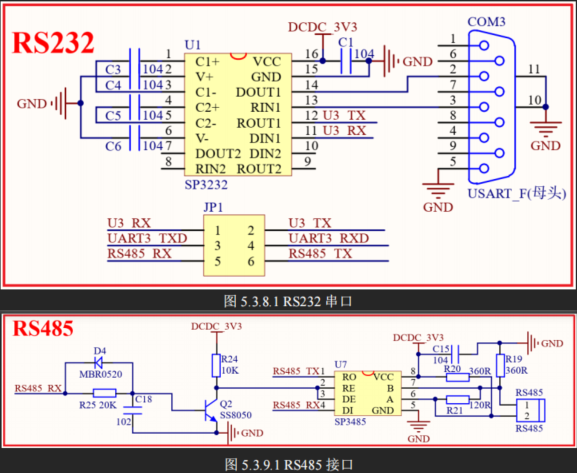

### 2.1.7 CAN1原理图
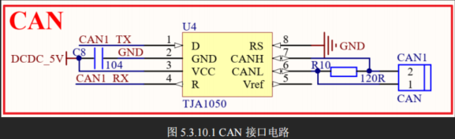

### 2.1.8 USB2-HUB原理图

### 2.1.9 USB1-OTG原理图
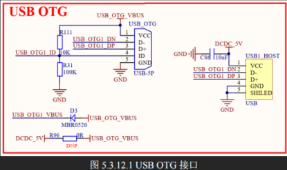

### 2.1.10 I2C1_SCLU4TX_SDAU4RX_APINTGPIO1-01_AP3216C_光环境传感器原理图
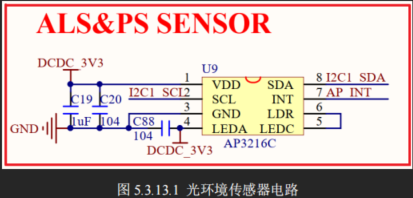

### 2.1.11 SPI3_SCKU2RX_SDIU2CTS_CSU2TX_SDOU2RTS_ICM20608六轴原理图
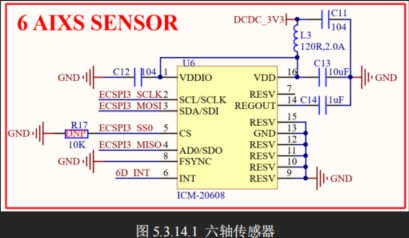

### 2.1.12 LED_RED_GPIO1-03_KEY0-U1CTS_BEEP-SNVS_TAMPER1原理图
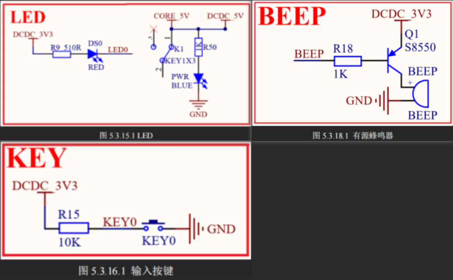

### 2.1.13 I2C2-SCCB_摄像头原理图
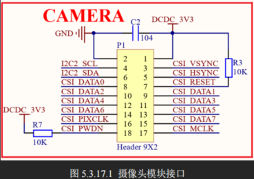

### 2.1.14 SD-CARD_SDIO-WIFI-RTL8198原理图
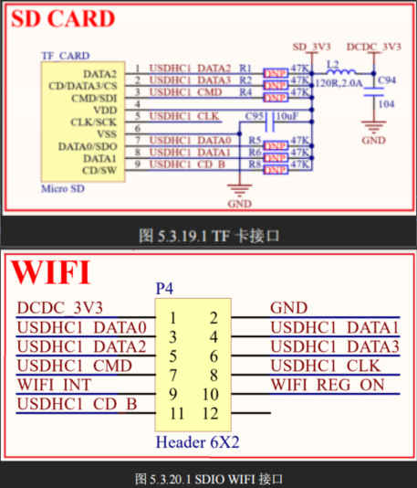

### 2.1.15 USB2_Mini_PCIE_4G原理图
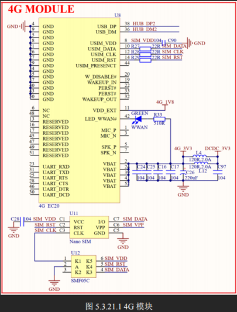

### 2.1.16 ATK接口U3_蓝牙GPSMPU6050激光手势RGB灯原理图
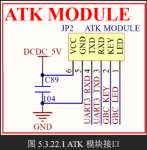

### 2.1.17 ETH1接口_RMII-PHY-LAN8720A原理图
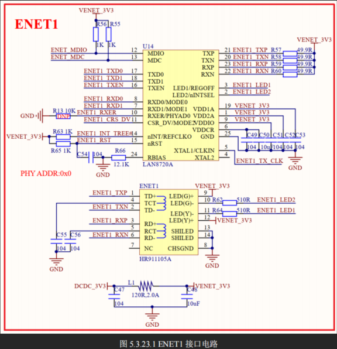

### 2.1.18 ETH2接口原理图
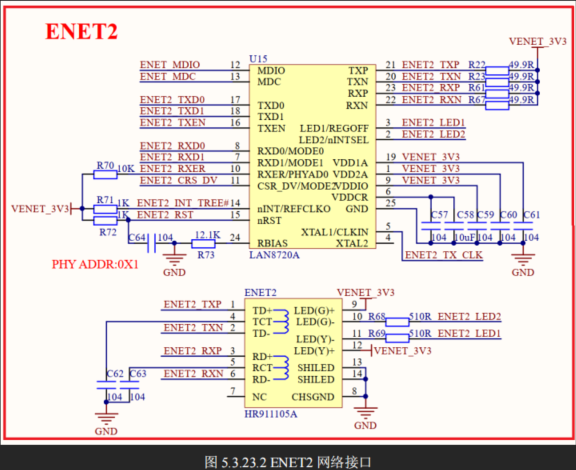

### 2.1.19 DAC-ADC-音频原理图
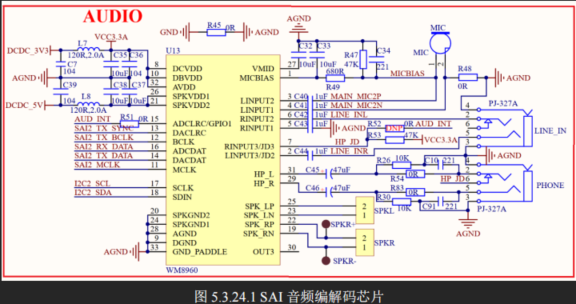

## 2.2 核心板原理图
### 2.2.1 SOC原理图
>1. **I.MX6U 核心板采用 MCIMX6Y2CVM08AB（800MHz，实际 792MHz）作为主控 CPU。**
>2. **具有 32KB 的 L1 指令和数据 Cache，以及 128KB 的 L2 Cache。**
>3. **集成 NEON，集成双精度硬件浮点计算单元 VFPv3。**
>4. **具有 128KB 的 OCRAM。**
>5. **具有 2 个通用定时器 GPT、4 个周期定时器 EPIT、**
**8 个 PWM、1 个 SDMA 控制器、4 个 ECSPI、3 个看门狗、**
**3 个 SAI、4 个 IIC、7 个串口、2 个 USB（高速，带 PHY）、**
**2 个 FlexCAN、2 个 12 位 ADC、1 个 SPDIF 接口、**
**1 个 SRTC、1 个 RTC、2 个 USDHC 接口、**
**1 个 RGB LCD 控制器（ELCDIF）、2 个 10/100M 以太网 MAC 控制器、**
**1 个摄像头接口、1 个硬件随机数生成器、以及 124 个通用 IO 口等。**
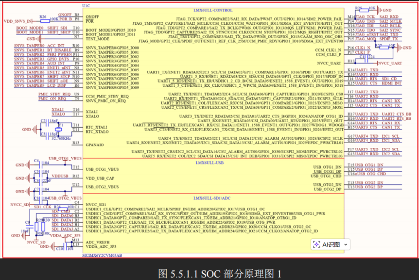
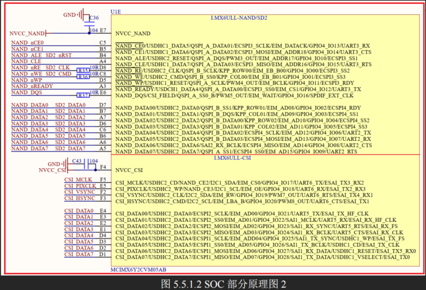

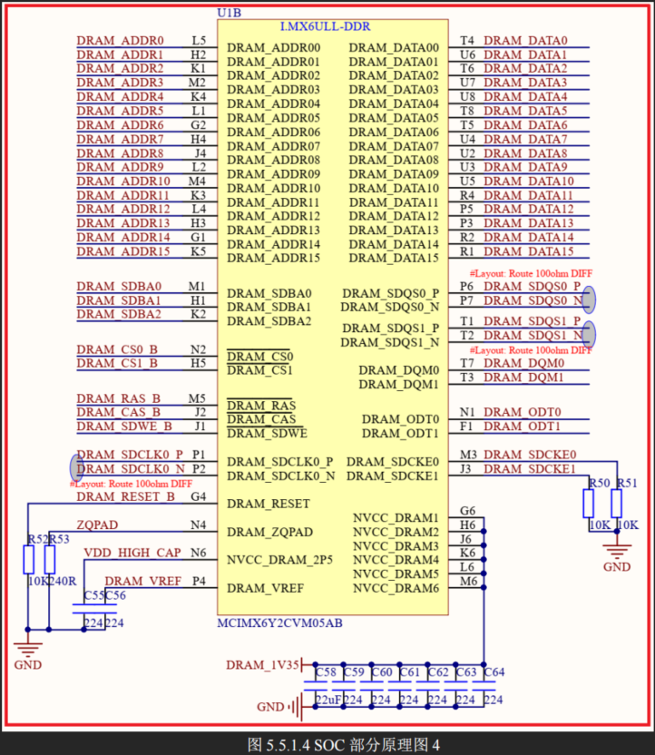
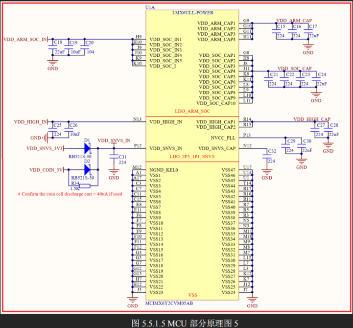

### 2.2.2 BTB底板接口原理图
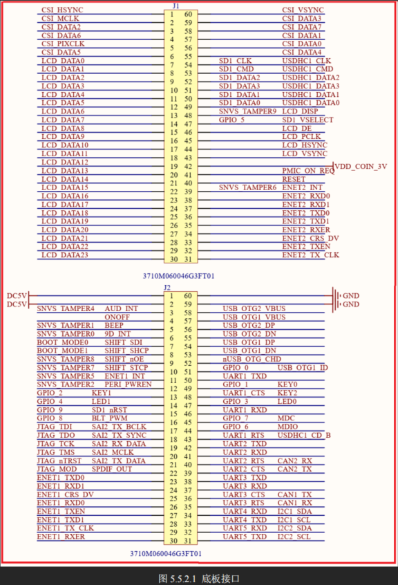

### 2.2.3 NAND-FLASH-512MB原理图
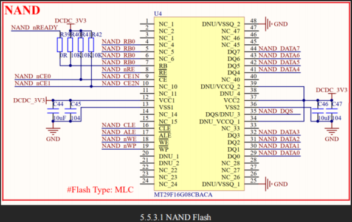

### 2.2.4 DDR3L-256MB原理图
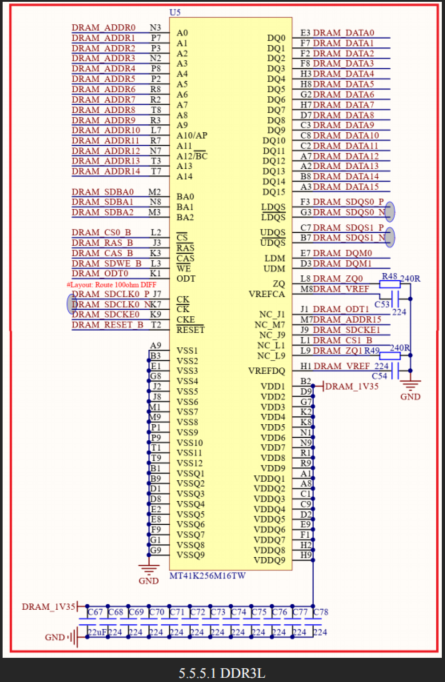