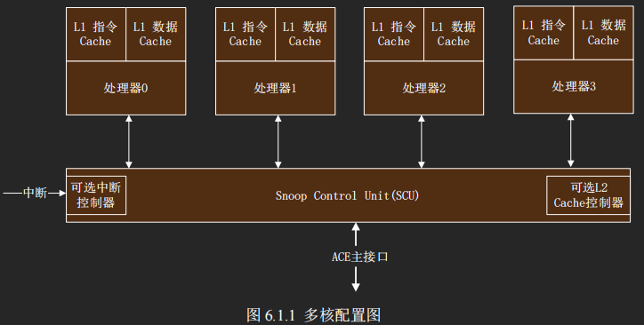
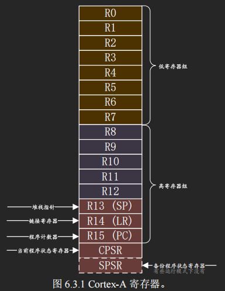
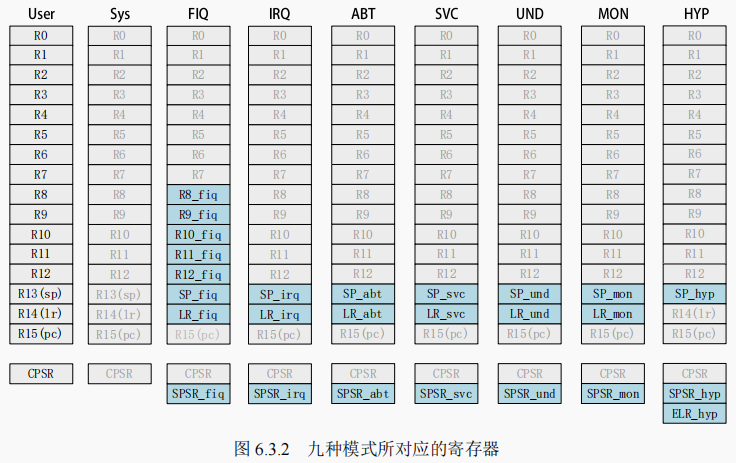
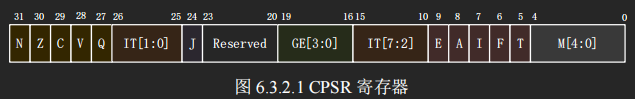
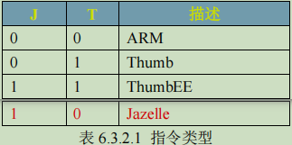
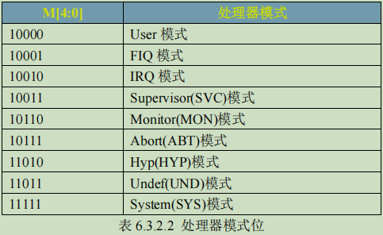

[TOC]

# 一、SOC介绍
## 1.1 Cortex-A7 MPCore 简介
Cortex-A7 MPcore 处理器支持 1~4 核，和 **Cortex-A15 + Cortex-A7**。
Cortex-A7 **主频1.2~1.6GHz**、28nm工艺、负责普通应用、省电、性能强于A8。

>1. IMX6UL 有 **32KB L1 指令 Cache、32KB L1 数据 Cache；128KB L2 Cache**。
>2. 支持 **SIMDv2 扩展整形和浮点向量操作**。
>3. 支持 ARM VFPv4 体系结构兼容的高性能的**单双精度浮点指令**，全功能的**IEEE754**。
>4. 支持**大物理扩展(LPAE)**，最高可以访问 **40 位存储地址**， 即 **1TB 的内存**。
>5. 支持**硬件虚拟化**。
>6. 支持 Generic Interrupt Controller V2.0（**GICv2.0**）。
>7. 支持 **NEON**，可以加速多媒体和信号处理算法。

## 1.2 处理器的 9 种运行模式
| 模式 | 描述 |
|  --- | ---- |
| **User(USR)**    | 用户模式，非特权模式，**大部分程序**运行的时候就处于此模式。|
| **FIQ**          | 快速中断模式，进入 **FIQ 中断**异常
| **IRQ**          |  **一般中断**模式。
| **Supervisor(SVC)** | 超级管理员模式，特权模式，**供操作系统**使用。
| **Monitor(MON)** | 监视模式？这个模式用于**安全扩展模式**。
| **Abort(ABT)**   | 数据访问终止模式，用于虚拟存储以及存储保护。
| **Hyp(HYP)**     | 超级监视模式？用于**虚拟化扩展**。
| **Undef(UND)**   | **未定义指令**终止模式。
| **System(SYS)**  | 系统模式，用于运行**特权级**的操作**系统任务**。

## 1.3 Cortex-A 寄存器组
| 寄存器 | 描述 |
|  --- | ---- |
| 通用寄存器(R0~R15) | 供软件使用，(R0~R14)为通用的数据存储，R15 是程序计数器 PC |
| 当前程序状态寄存器 CPSR |  |
| 备份程序状态寄存器 SPSR |  |

每种运行模式都有一组寄存器组（R0~R14 + CPSR[+SPSR]），有些是独立的，有些是共用的。
灰色是与 User 模式共有的，蓝色是各个模式特有的。
总共 **34 个32位通用**寄存器，**8个状态**寄存器，及Hyp模式独立的寄存器**ELR_hyp**。

### 1.3.1 通用寄存器 R0~R15
| 寄存器 | 名称 | 描述 |
|  --- | ---- | ----- |
| **R0~R7** | 未备份寄存器 | 在不同的模式下，这 8 个寄存器中的数据就会被破坏。|
| **R8~R14** | 备份寄存器 | **1）快速中断 FIQ 的 R8~R12** 是独立的，此中断处理程序可以不用执行保存和恢复中断现场的指令，从而加速中断的执行过程。**2）R13 SP，作为栈指针**，一共 8 个物理寄存器，其中一个是用户模式(User)和系统模式(Sys)共用的，剩下的 7 个分别对应 7 种不同的模式。**3）R14 LR，作为连接寄存器，存放当前子程序或异常的返回地址**，一共有 7 个物理寄存器，其中一个是用户模式(User)、系统模式(Sys)和超级监视模式(Hyp)所共有的，剩下的 6 个分别对应 6 种不同的模式。|
| **R15** | 程序计数器 PC | 保存着**当前执行的指令地址值加 8 个字节**，ARM 处理器 3 级流水线：**取指->译码->执行**，每条指令4字节，则PC存放的是第三条指令。|

### 1.3.2 程序状态寄存器 CPSR/SPSR
**所有的处理器模式都共用一个 CPSR 物理寄存器**，为避免冲突，除了 User、Sys 这两个模式以外（这两状态不是异常，不能访问 SPSR），其他 7 个模式每个都配备了一个**专用的物理状态寄存器 SPSR(备份程序状态寄存器)**。由于 SPSR 是 CPSR 的备份，因此 SPSR 和CPSR 的寄存器结构相同。
>1. 当特定的异常中断发生时，SPSR 寄存器用来**保存当前程序状态寄存器（CPSR）的值**。
>2. 当异常退出以后可以用 SPSR 中保存的值来**恢复 CPSR**。

| CPSR bits | 描述 |
| --------- | ----- |
| [31] N | N=1 表示运算对的结果为负数；N=0 表示结果为正数。|
| [30] Z | Z=1 表示运算结果为零，Z=0 表示运算结果不为零。对于 CMP 指令，Z=1 表示进行比较的两个数大小相等。 |
| [29] C | **1）加法**中表示产生了进位，C=1，表示无符号数运算发生上溢，其它情况下 C=0。**2）减法**中，当运算中发生借位，则 C=0，表示无符号数运算发生下溢，其它情况下 C=1。**3）包含移位操作的非加/减法**运算，C 中包含最后一次溢出的位的数值。|
| [28] V | 加/减法运算指令，当操作数和运算结果表示为二进制的补码表示的带符号数时，V=1 表示符号位溢出 |
| [27] Q | 仅 ARM v5TE_J 架构支持，表示饱和状态，Q=1 表示累积饱和 |
| [26:25] IT(1:0) | [15:10] IT(7:2)+(1:0)=[7:0]，作为 IF-THEN 指令执行状态 |
| [24] J | 仅 ARM v5TE-J 架构支持，J=1 表示处于 Jazelle 状态  |
| [19:16] GE | SIMD 指令有效，大于或等于 |
| [9] E | 大小端控制位，E=1 表示大端模式，E=0 表示小端模式 |
| [8] A | 禁止异步中断位，A=1 表示禁止异步中断 |
| [7] I | I=1 禁止 IRQ，I=0 使能 IRQ |
| [6] F | F=1 禁止 FIQ，F=0 使能 FIQ |
| [5] T | 控制指令执行状态，表明本指令是 ARM 指令还是 Thumb 指令 |
| [4:0] M | 处理器模式控制位  |

# 二、编译器
## 2.1 推荐Linaro编译器下载
| 编译器类型 | 说明 | 下载链接 |
| --------- | ---- | ------- |
| aarch64-elf | 64 位裸机编译器 | [gcc-linaro-7.5.0-2019.12-x86_64_aarch64-elf](https://releases.linaro.org/components/toolchain/binaries/latest-7/aarch64-elf/gcc-linaro-7.5.0-2019.12-x86_64_aarch64-elf.tar.xz) |
| aarch64-linux-gnu | 64 位系统编译器 | [gcc-linaro-7.5.0-2019.12-x86_64_aarch64-linux-gnu](https://releases.linaro.org/components/toolchain/binaries/latest-7/aarch64-linux-gnu/gcc-linaro-7.5.0-2019.12-x86_64_aarch64-linux-gnu.tar.xz) |
| arm-eabi | 32位裸机编译器 | [gcc-linaro-7.5.0-2019.12-x86_64_arm-eabi](https://releases.linaro.org/components/toolchain/binaries/latest-7/arm-eabi/gcc-linaro-7.5.0-2019.12-x86_64_arm-eabi.tar.xz) |
| arm-linux-gnueabi | 32位系统编译器，软浮点、兼容性好 | [gcc-linaro-7.5.0-2019.12-x86_64_arm-linux-gnueabi](https://releases.linaro.org/components/toolchain/binaries/latest-7/arm-linux-gnueabi/gcc-linaro-7.5.0-2019.12-x86_64_arm-linux-gnueabi.tar.xz) |
| arm-linux-gnueabihf | 32位系统编译器，硬浮点带FPU、性能最高 | [gcc-linaro-7.5.0-2019.12-x86_64_armeb-linux-gnueabihf](https://releases.linaro.org/components/toolchain/binaries/latest-7/armeb-linux-gnueabihf/gcc-linaro-7.5.0-2019.12-x86_64_armeb-linux-gnueabihf.tar.xz) |