[TOC]

# 一、I.MX6U 启动方式介绍
支持的启动方式包括：**SD、eMMC、NandFlash、QSPIFlash**。
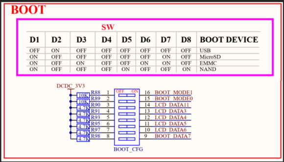
**串行下载**为 USB 和 UART，需要 boot_mode[1:0] 设置为 OFF/ON，需要特殊的软件来下载。
**内部 BOOT 模式**会执行内部 bootROM 代码，置 boot_mode[1]=ON，会初始化一部分外设。
bootROM初始化的内容包括：**时钟、开 MMU/ Cache（bootROM完成后会关掉）**。
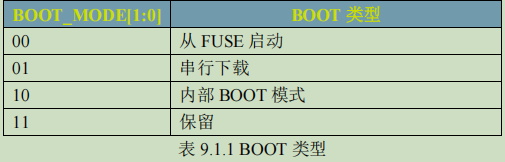
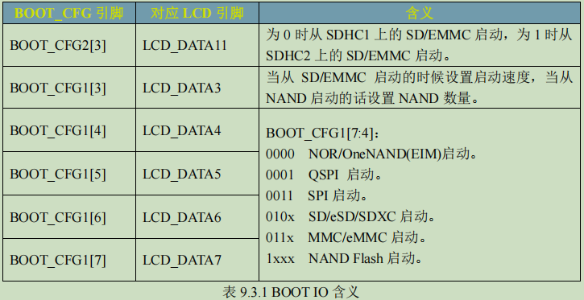
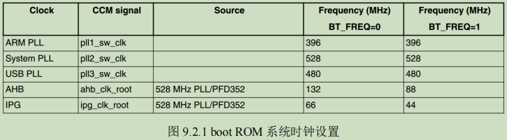

# 二、I.MX6U 镜像烧录文件的组成
镜像烧写的时候，不是纯粹的 bin 文件，而是添加了头部信息的 imx 文件。其中头部信息占 3KB。
烧录文件的组成如下：
| 段名 | 描述 |
| ---- | ---- |
| IVT(Image vector table) | 包含了一系列的地址信息，这些地址信息在ROM 中按照固定的地址存放着。 |
| boot data | 启动数据，包含了镜像要拷贝到哪个地址，拷贝的大小是多少等等。 |
| DCD(Device configuration data) | 重点是 DDR3 的初始化配置。 |
| bin 文件 | 用户代码编译的可执行文件。 |
## 2.1 IVT 和 Boot Data 数据
IVT 包含了镜像程序的入口点、指向 DCD 的指针和一些用作其它用途的指针。内部 Boot ROM 要求 **IVT 应该放到指定的位置**，不同的启动设备位置不同。
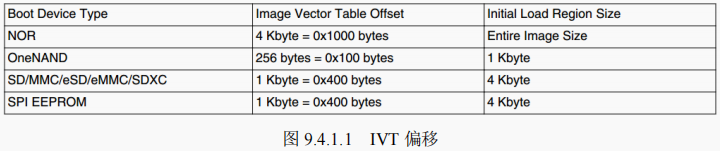
IVT 的格式如下：
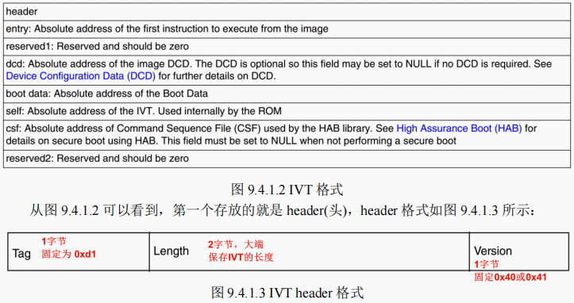
Boot Data 的格式如下：
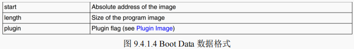
## 2.2 DCD 数据
**DCD（Device configuration data）是寄存器地址和对应的配置信息集合，其起始地址是0x2C**。bootROM 利用 DCD 信息来初始化片内的一些寄存器（如初始化外设时钟、初始化 DDR 等），DCD 区域不能超过 1768Byte，其紧跟在 IVT 和 Boot Data 后面，IVT 里面也指定了 DCD 的位置。
DCD 的格式如下：
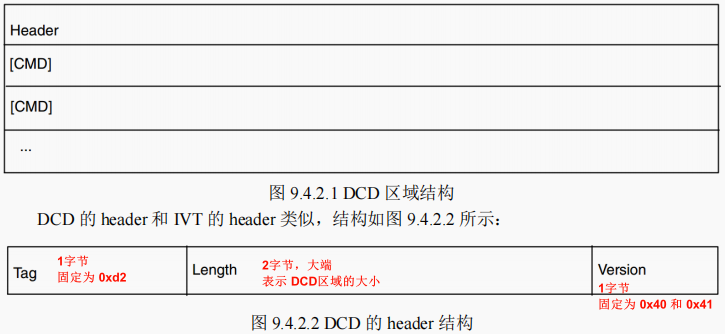
DCD CMD 的格式如下：
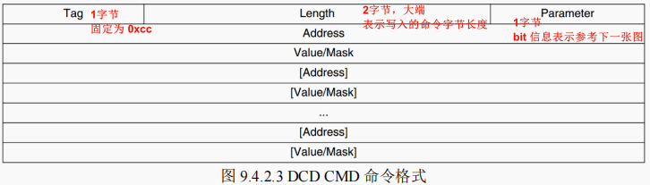
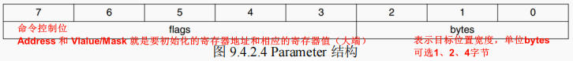
## 2.3 DCD 数据的实际应用
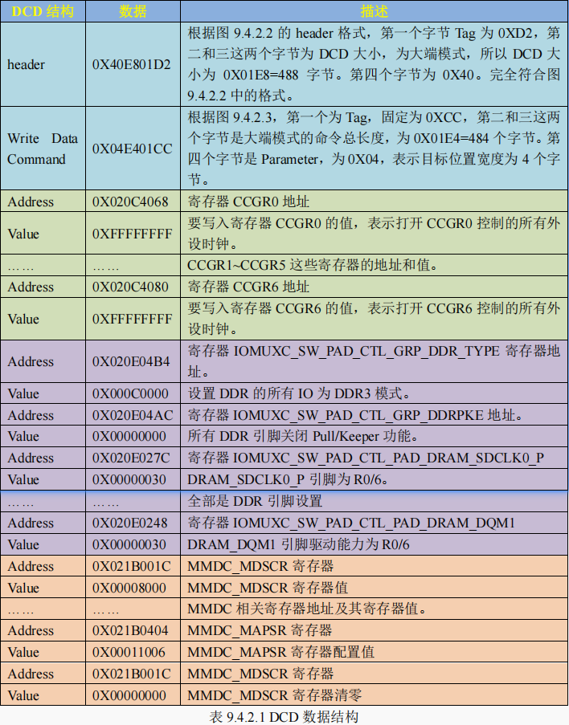
