[TOC]

# 一、ARM处理器的16个协处理器
ARM最多支持16个协处理器，CP0~CP15。
| 处理器 | 描述 |
| ---- | ---- |
| CP15 | 提供系统控制功能，主要用于配置**MMU、TLB和Cache**等功能。|
| CP14 | 主要用于控制系统Debug功能。|
| CP10、CP11 | 对浮点运算和向量操作的支持，用于控制和配置浮点功能和高级SIMD指令扩展。|
| 其他协处理器 | 保留用于将来使用。|

# 二、CP15协处理器
## 2.1 概述
CP15协处理器支持16个32位主寄存器，命名为c0~c15。c0~c15主寄存器各自又有多个32位的物理寄存器，CP15协处理器的大多数寄存器不能在USR模式下访问，只能在除USR模式外的其他模式下访问。
| primary register | physical register | 描述 |
| ---- | ---- | ---- |
| c0 | MIDR | 主ID寄存器，用于记录版本信息 |
| c0 | MPIDR | 多核处理器情况下，提供一种方法来唯一标识集群中的各个核心 |
| c1 | SCTLR | 系统控制寄存器 |
| c1 | ACTLR | 辅助控制寄存器 |
| c1 | CPACR | 协处理器访问控制寄存器，控制访问除了CP14和CP15的协处理器 |
| c1 | SCR | 安全配置寄存器，被TrustZone使用 |
| c2、c3 | TTBR0 | 一级转换页表基址寄存器0 |
| c2、c3 | TTBR1 | 一级转换页表基址寄存器1 |
| c2、c3 | TTBCR | 页表转换控制寄存器 |
| c5、c6 | DFSR | 数据异常（Data Fault）状态寄存器 |
| c5、c6 | IFSR | 指令异常（Instruction Fault）状态寄存器 |
| c5、c6 | DFAR | 数据异常（Data Fault）地址寄存器 |
| c5、c6 | IFAR | 指令异常（Instruction Fault）地址寄存器 |
| c7 | branch predictor | cache和分支预测管理功能 |
| c7 | barrier | 数据和指令屏障操作 |
| c8 | TLB | TLB操作 |
| c9 | performance monitors | 性能监视器 |
| c12 | VBAR | 提供非监视模式处理异常的异常基地址 |
| c12 | MVBAR | 提供监视模式处理异常的异常基地址 |
| c13 | CONTEXTIDR | 上下文ID寄存器 |
| c15 | CBAR | 配置基址寄存器，为GIC和本地时钟类型外设提供基地址 |
## 2.2 CP15协处理器主寄存器组成
CP15协处理器有c0~c15总共16个主寄存器，在每个主寄存器下面，又有多个物理寄存器。
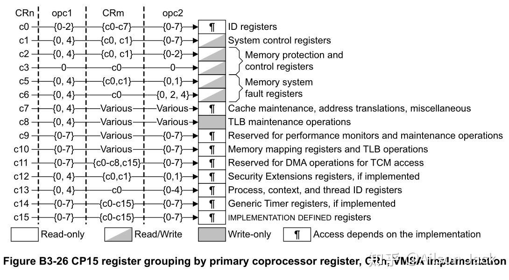
### 2.2.1 CP15-C0寄存器组成
c0主要提供ID相关的功能。
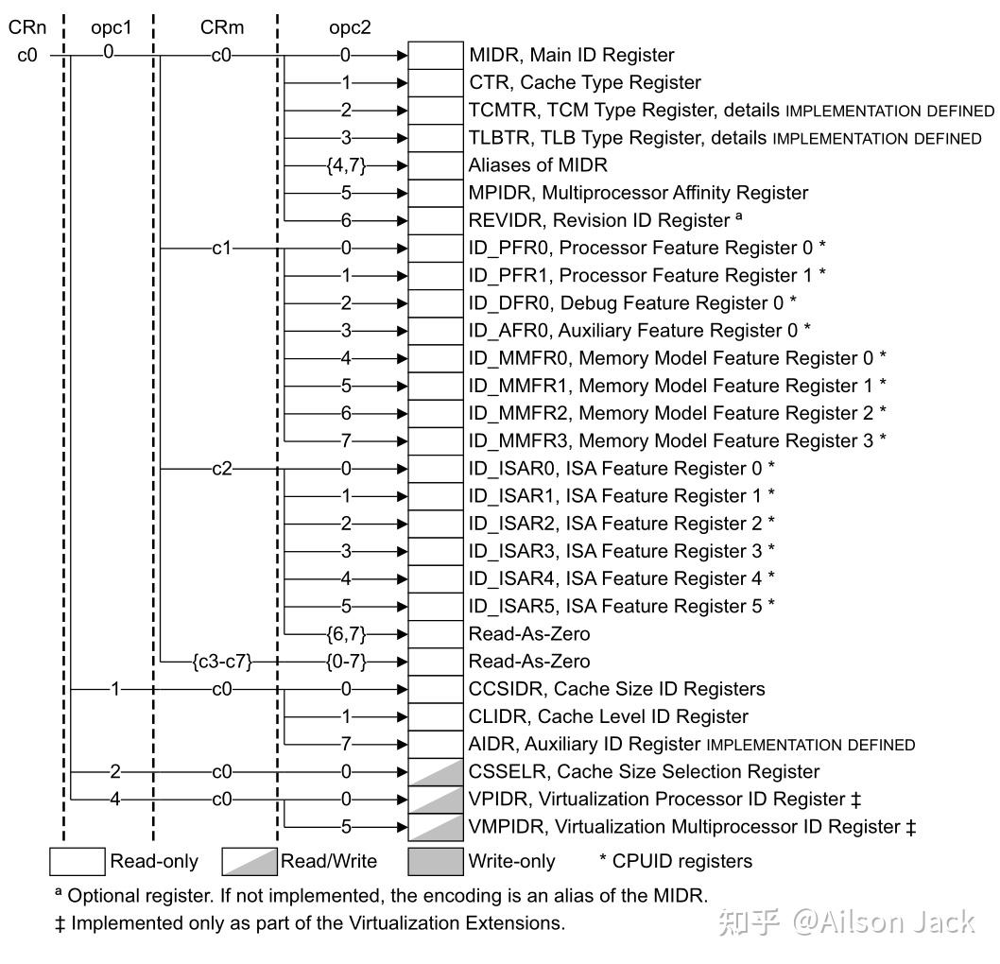
### 2.2.2 CP15-C1寄存器组成
c1主要提供系统控制相关的功能。
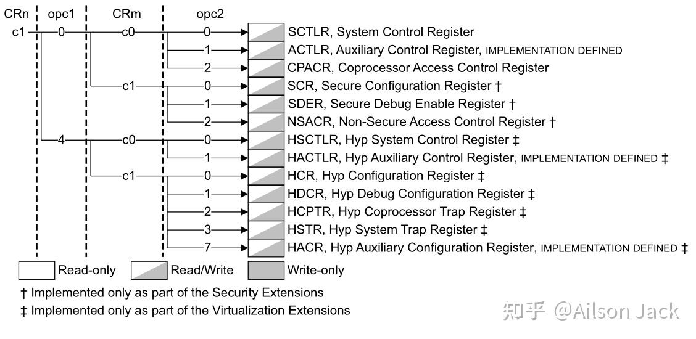
在CP15协处理器的寄存器中，系统控制寄存器SCTLR是被访问的比较多的寄存器。
SCTLR寄存器的访问需要在PL1或者更高的特权等级。
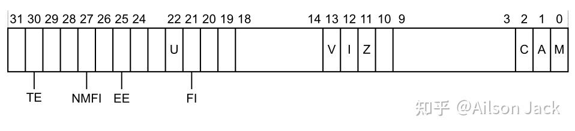
| 位 | 标志 | 说明 |
| ---- | ---- | ---- |
| 30 | TE | Thumb异常使能，控制在异常发生时（包括reset），将会进入哪种指令集，0：ARM指令集，1：Thumb指令集 |
| 27 | NMFI | 不可屏蔽的FIQ支持，0：软件可以通过写CPSR.F位来屏蔽FIQ，1：软件不可以通过写CPSR.F位来屏蔽FIQ |
| 25 | EE | 在进入异常处理时的大小端模式配置，0：小端，1：大端 |
| 22 | U | 表明是否使用对齐模式 |
| 21 | FI | FIQ配置使能 |
| 13 | V | 选择异常向量表基址，0：0x00000000，1：0xffff0000 |
| 12 | I | 指令cache使能 |
| 11 | Z | 分支预测使能 |
|  2 | C | 数据cache使能 |
|  1 | A | 对齐检查使能 |
|  0 | M | MMU使能 |
### 2.2.3 CP15-C2、c3寄存器组成
c2和c3主要提供内存保护和内存控制相关的功能。
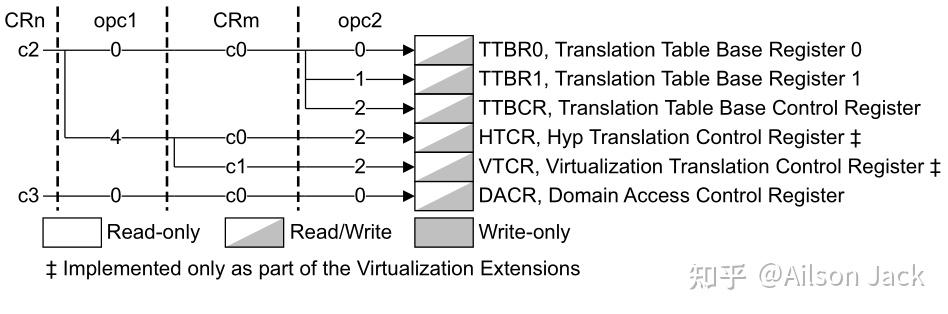
### 2.2.1 CP15-C4寄存器组成
c4寄存器没有被使用。
### 2.2.1 CP15-C5、c6寄存器组成
c5和c6主要提供内存系统错误上报功能。
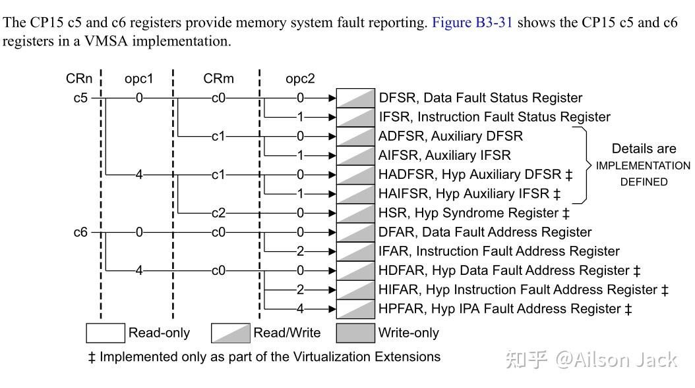
### 2.2.1 CP15-C7寄存器组成
c7主要提供cache维护，地址转换和内存屏障操作相关的功能。
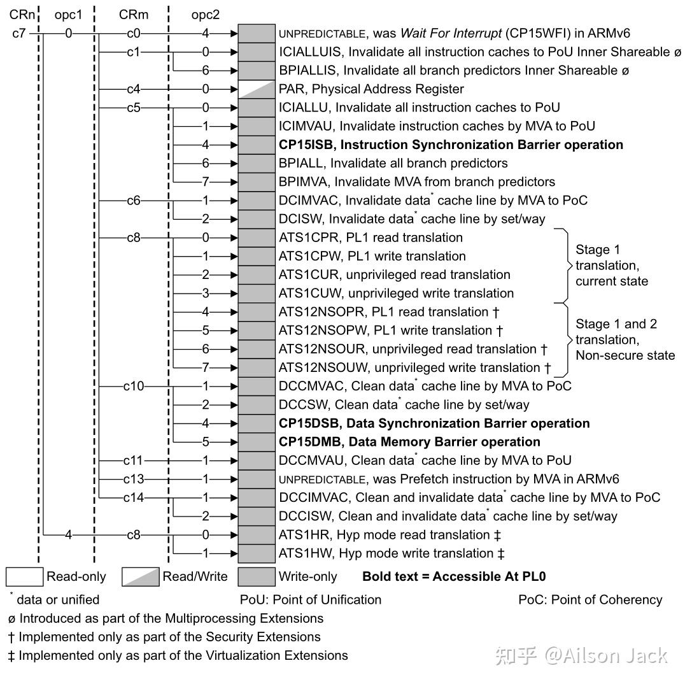
### 2.2.1 CP15-C8寄存器组成
c8主要提供TLB维护相关的功能。
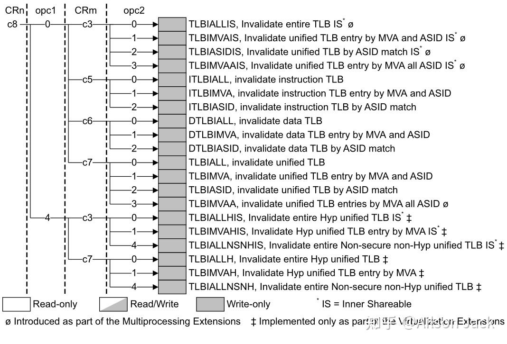
### 2.2.1 CP15-C9寄存器组成
c9保留用于分支预测，cache和TCM操作。
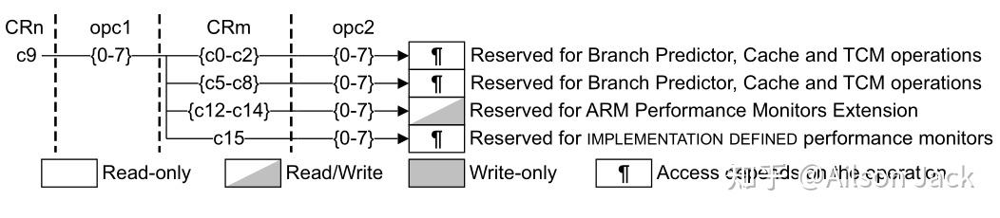
### 2.2.1 CP15-C10寄存器组成
c10主要提供内存重映射和TLB控制相关的功能。
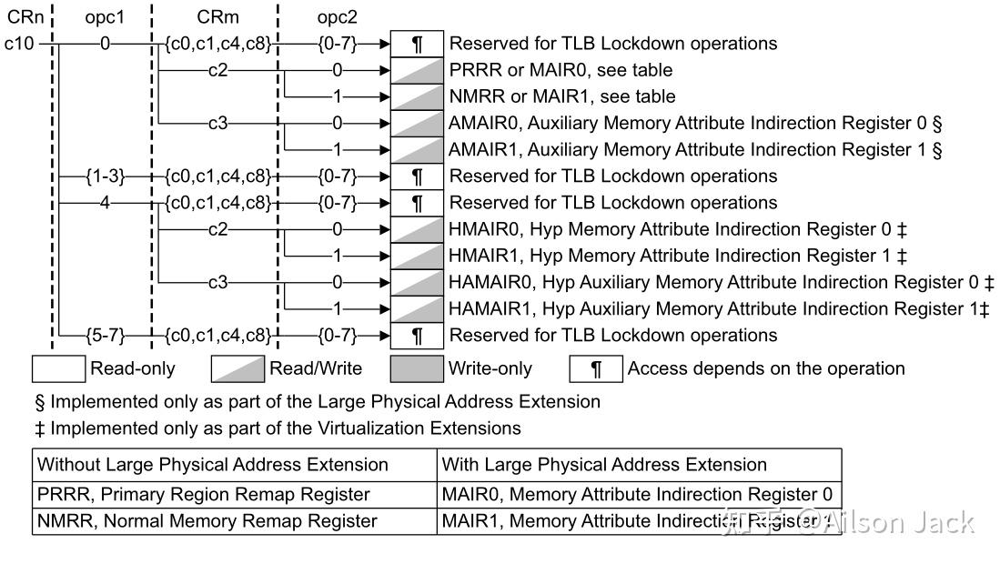
### 2.2.1 CP15-C11寄存器组成
c11保留用于TCM DMA操作。
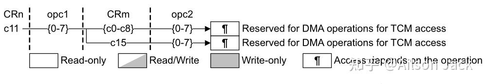
### 2.2.1 CP15-C12寄存器组成
c12提供安全扩展功能。
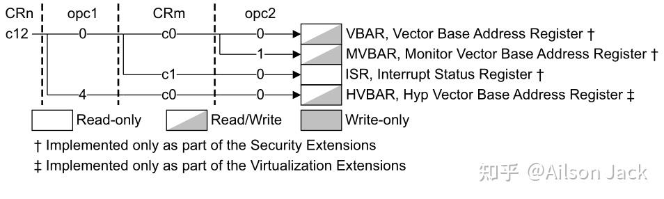
### 2.2.1 CP15-C13寄存器组成
c13提供进程ID、上下文ID和线程ID处理功能。
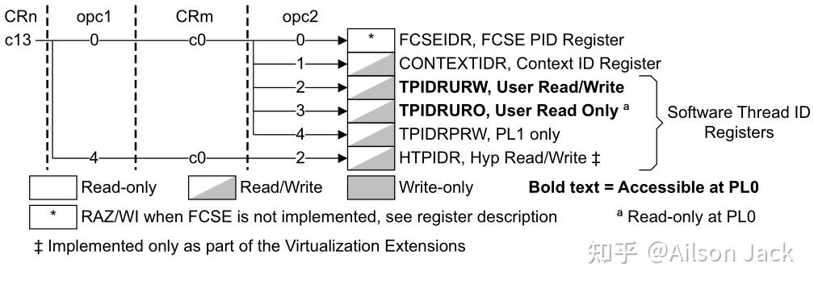
### 2.2.1 CP15-C14寄存器组成
c14保留用于通用定时器功能。
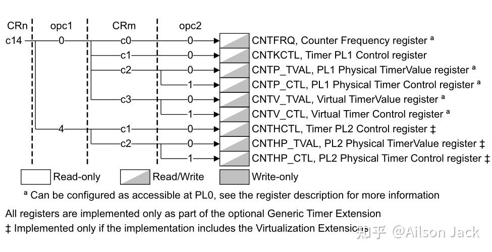
### 2.2.1 CP15-C15寄存器组成
c15由处理器实现决定。

# 三、协处理器操作指令
ARMv7-A体系结构的处理器提供了 **MRC** 和 **MCR** 指令用于对协处理器进行读写操作。
## 3.1 MRC
将CP15协处理器中的寄存器数据读取到ARM通用寄存器中。
```bash
    MRC{cond} coproc, opc1, Rt, CRn, CRm{, opc2}
    # cond为条件码
    # coproc为协处理器名称，CP0~CP15协处理器分别对应名称p0~p15
    # opc1为协处理器要执行的操作码，取指范围为0~7
    # Rt为ARM通用寄存器，用于存储读取到的协处理器寄存器数据
    # CRn为协处理器寄存器，对于CP15协处理器来说，CRn取值范围为c0~c15
    # CRm为协处理器寄存器，对于CP15协处理器来说，通过CRm和opc2一起来确定CRn对应的具体寄存器
    # opc2为可选的协处理器执行操作码，取指范围为0~7，当不需要的时候要设置为0

    # 示例，读取主ID寄存器 MIDR 的数据到 R0 中.
    MRC p15, 0, R0, c0, c0, 0
```
## 3.2 MCR
将ARM通用寄存器中的数据写入到CP15协处理器的寄存器中。
``` bash
    MCR{cond} coproc, opc1, Rt, CRn, CRm{, opc2}
    # cond为条件码
    # coproc为协处理器名称，CP0~CP15协处理器分别对应名称p0~p15
    # opc1为协处理器要执行的操作码，取指范围为0~7
    # Rt为ARM通用寄存器，用于存储要写入到协处理器寄存器中的数据
    # CRn为协处理器寄存器，对于CP15协处理器来说，CRn取值范围为c0~c15
    # CRm为协处理器寄存器，对于CP15协处理器来说，通过CRm和opc2一起来确定CRn对应的具体寄存器
    # opc2为可选的协处理器执行操作码，取指范围为0~7，当不需要的时候要设置为0

    # 示例，将 R0 中的配置数据写入到 SCTLR
    MCR p15, 0, R0, c1, c0, 0
```