[TOC]

# 一、IMX6ULL参考手册32章IOMUXC及配置
[IMX6ULL参考手册](../../docs/IMX6ULL参考手册.pdf)
I.MX6ULL 的 IO 分为两类：**SNVS 域的和通用的**

## 1.1 PAD-MUX配置引脚复用
### 1.1.1 MUX-PAD-GPIO1_IO00
IOMUXC_SW_MUX_CTL_PAD_**GPIO1_IO00**，其中的 GPIO1_IO00 就是 GPIO 的命名
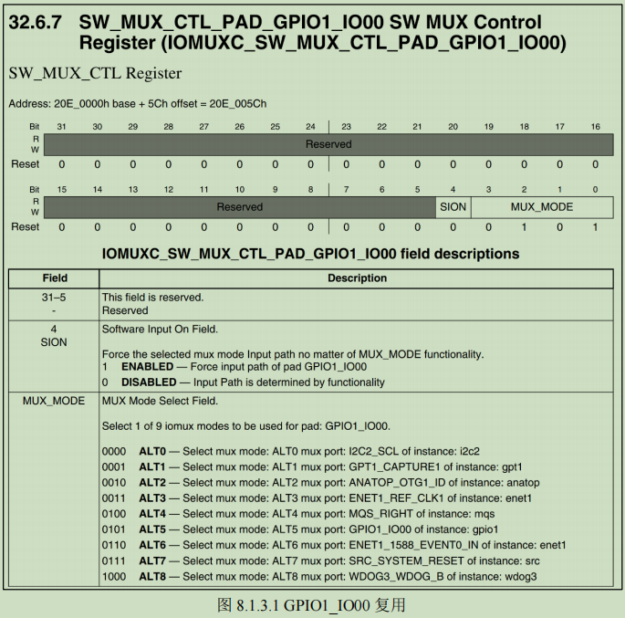
其中 MUX_MODE 就是配置这个 IO_PAD 的复用功能

### 1.1.2 MUX-PAD-UART1_TX_DATA
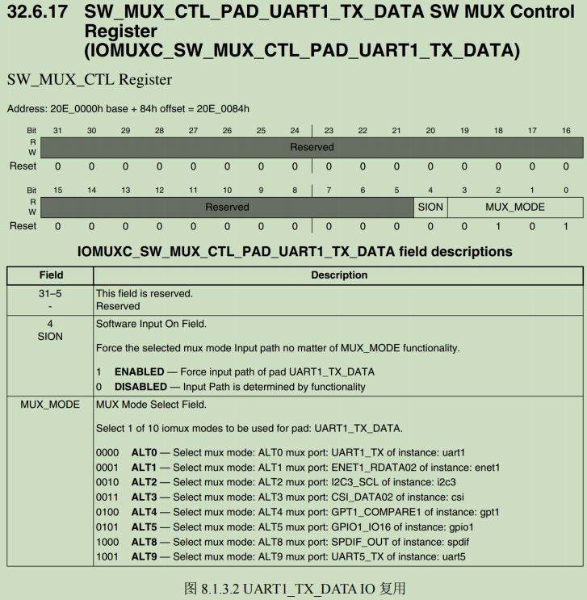

### 1.1.3 MUX-PAD-LED_GPIO1_IO03
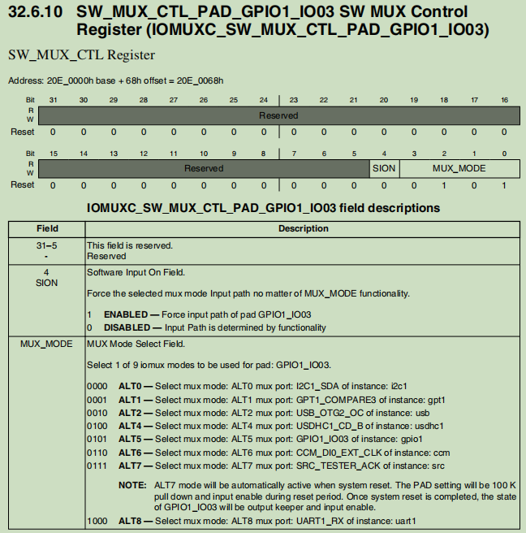

## 1.2 PAD-CFG配置引脚属性
### 1.2.1 CFG_PAD_GPIO1_IO00
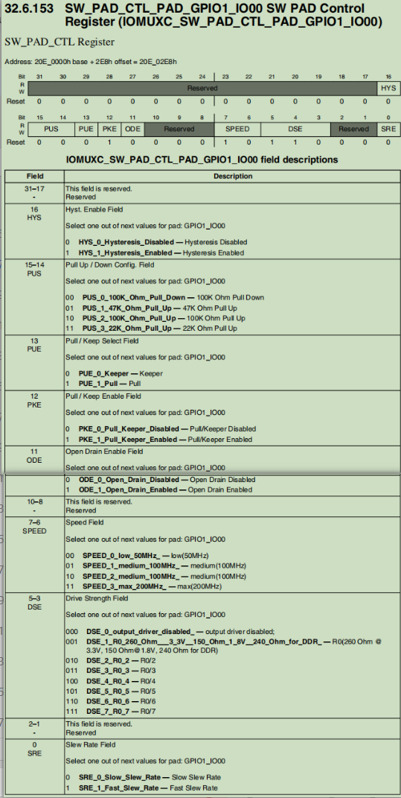

# 二、IMX6ULL参考手册28章GPIO及配置
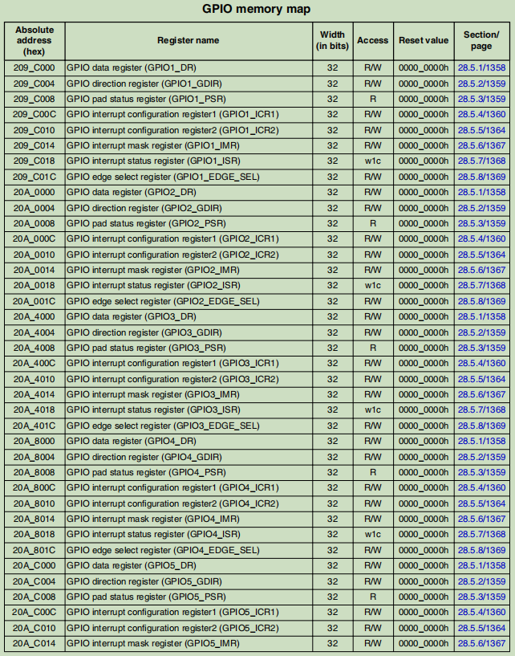
## 2.1 PAD-GPIO输入输出相关寄存器
与输入输出相关的寄存器有8个 **DR、GDIR、PSR、ICR1、ICR2、EDGE_SEL、IMR 和 ISR**
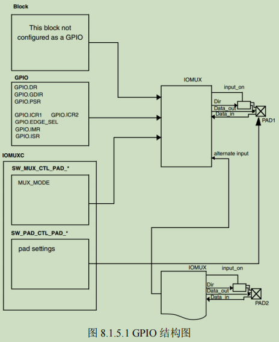
### 2.1.1 PAD-GPIO_DR数据寄存器
每个 bit 代表一个 GPIO，
当 GPIO 被配置成输出时，写入相应bit就是设置 GPIO 的输出电平；
当 GPIO 被配置成输入时，此寄存器就保存着对应 IO 的输入电平值。
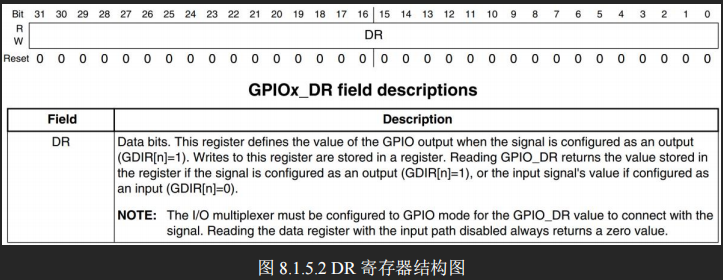
### 2.1.2 PAD-GPIO_GDIR方向寄存器
每个 bit 代表一个 GPIO，0 表示输入，1 表示输出。
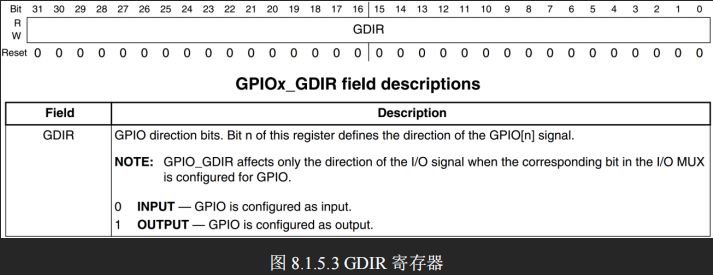
### 2.1.3 PAD-GPIO_PSR状态寄存器
每个 bit 代表一个 GPIO，功能和输入状态下的 DR 寄存器一样。

### 2.1.4 PAD-GPIO_ICR1-PAD-GPIO_ICR2中断控制寄存器
ICR1 用于 IO0~15 的配置， ICR2 用于 IO16~31 的配置。
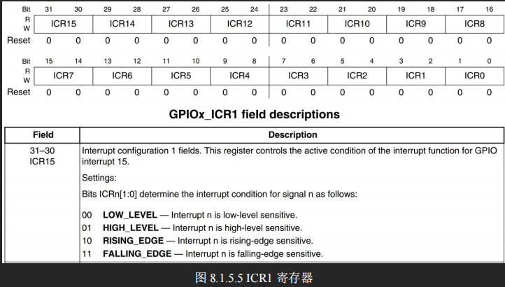
这两个 bit 可以用来配置中断的触发方式。

### 2.1.5 PAD-GPIO_IMR中断屏蔽寄存器
每个 bit 代表一个 GPIO，置 1 表示使能某个 GPIO 的中断，清 0 禁止中断。
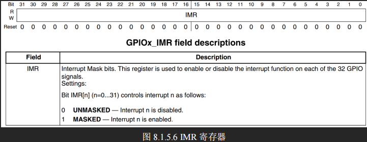
### 2.1.6 PAD-GPIO_ISR中断状态寄存器寄存器
每个 bit 代表一个 GPIO，当 GPIO 的中断发生，则 ISR 中相应的位就会被置 1，**W1C**。
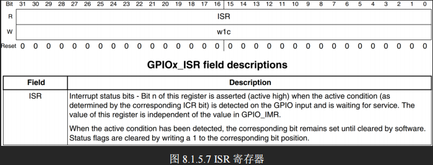
### 2.1.7 PAD-GPIO_EDGE_SEL边沿选择寄存器
这个寄存器会覆盖 ICR1 和 ICR2 的设置，一个 bit 对应一个 GPIO。置 1 表示双边沿触发。
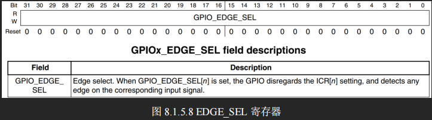

# 三、IMX6ULL参考手册18章CCM时钟
## 3.1 GPIO时钟使能CCM_CCGR0寄存器
CMM 有 CCM_CCGR0~CCM_CCGR6 这 7 个寄存器，控制着 I.MX6U 的所有外设时钟开关。
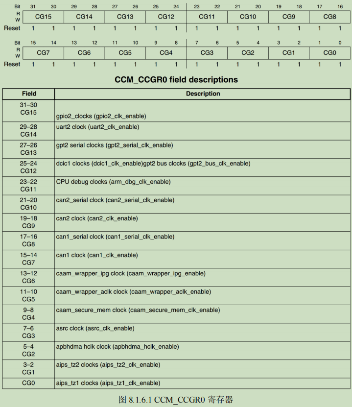
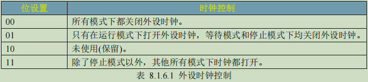

# 四、GPIO点灯
## 4.1 硬件原理图
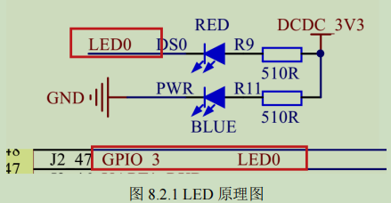
蓝色的灯接的是 **GPIO1_IO03，低电平导通**。
## 4.2 点灯汇编程序
### 4.2.1 点灯流程
>1. 使能 GPIO1 时钟，**0X020C406C，CCM_CCGR1[27:26] = b11**。
>2. 设置 IOMUXC_SW_MUX_CTL_PAD_GPIO1_IO03 PAD 复用为 GPIO 功能，**0x020E0068**。
>3. 配置 IOMUXC_SW_PAD_CTL_PAD_GPIO1_IO03，**0x020E02F4**。
>4. 设置 GPIO 属性：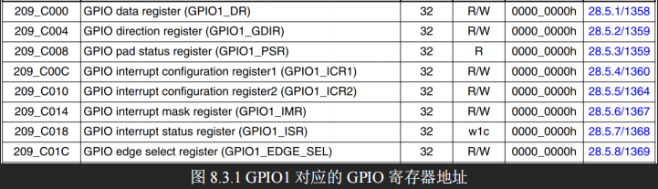
>5. 控制 GPIO 电平，**低：GPIO1_GDIR &= ~(0x1 << 3)；高：GPIO1_GDIR |= (0x1 << 3)**。
### 4.2.2 编程
参考 led.s 和 Makefile
### 4.2.3 编译-生成bin文件-反汇编
编译链接时，指定链接的起始地址为 **0X87800000（DDR）**
``` bash
    arm-linux-gnueabihf-ld -Ttext 0X87800000 led.o -o led.elf
```
编译完成后，将 led.elf 文件转换为.bin 文件
``` bash
    arm-linux-gnueabihf-objcopy -O binary -S -g led.elf led.bin
    # -O binary 表示以二进制格式输出
    # -O ihex 表示以 hex 格式输出
    # -S 表示不要复制源文件中的重定位信息和符号信息
    # -g 表示不复制源文件中的调试信息
```
编译完成后，反汇编
``` bash
    arm-linux-gnueabihf-objdump -D led.elf > led.asm
    # -D 表示反汇编所有的段
```
## 4.3 代码烧写
bootROM 是 NXP 内部使用的，支持NorFlash、NANDFlash、SD/eMMC、SPINorFlash和QSPIFlash启动，其中只有 SD 卡是活动的，因此调试裸机程序将 bin 文件烧录到 SD 中，从 SD 卡启动。
《IMX6UL 参考手册》第 8 章 Chapter 8 System Boot 说明了 I.MX6U 的启动。
正点原子专门编写了一个软件 imxdownload 将 bin 文件烧写到 SD 卡中。