[TOC]

# 一、SDK移植
SDK 文件为： **SDK_2.2_MCIM6ULL_RFP_Linux.run**。
直接执行，将 sdk 解压到自定义目录 sdk_2.2_MCIM6ULL 中：
```bash
    bash ./sdk_2.2_MCIM6ULL/SDK_2.2_MCIM6ULL_RFP_Linux.run
```
sdk_2.2_MCIM6ULL 目录结构
```bash
boards/evkmcimx6ull
    demo_apps         // freertos_camera/lwip/powermode_switch/sai_sdma_freertos
    driver_examples   // adc/cache/csi/enet/gpio/iic/mmdc/sai/uart/...
    project_template  // 单个工程模板
    rtos_examples     // 许多freertos相关项目模板
    usb_examples      // 许多usb相关项目模板
CMSIS/include
    cmsis_gcc.h       // 只有这一个头文件，arm指令操作接口
CORTEXA/include
    core_ca.h         // 包含了cortexa_gcc.h
    core_ca7.h        // 包含了core_ca.h，封装了CPSR/CP15/L1Cache/MMU/GIC等操作接口
    cortexa_gcc.h     // 包含了cmsis_gcc.h，且增加了MRS/MSR/CPSR等相关指令
devices
    MCIMX6Y2          // 开发板的芯片，包含derivers/lds/utils/MCIMX6Y2.h/start.S等
        drivers       // 各种驱动，adc/cache/clock/csi/enet/gpc/i2c/iomux/pmu/...
        gcc           // lds文件及startup文件，含flash/ram
        utilities     // 有debug_console/io/log/sbrk/str等
        fsl_device_registers.h  // 包含MCIMX6Y2.h及MCIMX6Y2_features.h
        MCIMX6Y2_features.h     // 定义本芯片的各个IP的数量
        MCIMX6Y2.h              // 包含中断号/muxpad相关/adc相关/ahb等地址与配置等
        system_MCIMX6Y2.x       // 包含irq配置，clock配置，systick等相关函数
doc
middleware
    fatfs_0.12c
    lwip_2.0.2
    sdmmc_2.1.2
    usb_1.6.3
rtos/freertos_9.0.0
tools                 // cmake/imgutil/mfgtools
Makefile              // 自定义的Makefile，用于将sdk编译成库
```

# 二、分析lds和start.S及Makefile
## 2.1 将 sdk 编译成 .a 库
``` bash
    # rcs 表示创建库（若不存在）、替换文件、更新索引
    arm-linux-gnueabihf-ar rcs out/libimx6ull.a $(OBJO)
    # 在引用该库的Makefile中，使用-Lout -limx6ull引用库
```
## 2.2 Makefile
``` bash
    # -Wl,-Map=$(OUT_DIR)/$@/$@.map，-Wl表示后面的参数传递给链接器，-map表示生成Map文件
    # objcopy -S -g，-S负责剥离符号表和重定位信息，-g则专注于移除调试符号
    #		  --only-section 或 -j，只拷贝特定的段到bin文件
    # objdump --remove-section 排除特定的段
```
## 2.3 lds文件
``` bash
    # lds 文件的内存布局情况，最终生成的 bin 文件按 LMA 排布： 
    .section : {
        *;
    } > VMA AT (LMA)
    # 若某些段没有显式指定AT(LMA)，链接器默认将LMA设为与VMA相同。当objcopy生成BIN时，它就会在文件中填充巨大的空隙，以匹配这些LMA地址。
    PROVIDE_HIDDEN (__preinit_array_start = .)
    # PROVIDE_HIDDEN 允许你定义仅在链接脚本内部可见的“弱符号”，为跨模块的接口定义和内存布局管理提供了独特的灵活性。
    # 如果程序代码中没有定义这个符号，并且代码中引用了它，那么链接器就使用我在这里提供的定义；如果程序代码中已经定义了这个符号，那么就忽略我的定义。
    .ARM.attributes 0 : { *(.ARM.attributes) }
    # 存放 ARM 相关的架构、版本、标签等元数据。用于确保所有目标文件中的 ARM 属性信息被正确收集并放置在输出文件的指定位置。
    # VMA 为 0，这通常意味着该段的内容在程序运行时不会被加载到内存中执行。
```
## 2.4 利用gcc工具分析各个段
### 2.4.1 readelf -l 查看段信息
``` bash
    arm-linux-gnueabihf-readelf -l 01-sdk_led.elf

Elf file type is EXEC (Executable file)
Entry point 0x800022dc
There are 9 program headers, starting at offset 52

Program Headers:
  Type           Offset   VirtAddr   PhysAddr   FileSiz MemSiz  Flg Align
  LOAD           0x010000 0x00900000 0x00900000 0x00024 0x00428 RW  0x10000
  LOAD           0x012000 0x80002000 0x80002000 0x0003c 0x0003c R   0x10000
  LOAD           0x012040 0x80002040 0x80002040 0x551ec 0x551ec RWE 0x10000
  LOAD           0x100000 0x80400000 0x8005722c 0x00f1c 0x00f1c RW  0x10000
  LOAD           0x100f20 0x80400f20 0x80058150 0x00000 0x01be8 RW  0x10000
  NOTE           0x010000 0x00900000 0x00900000 0x00024 0x00024 R   0x4
  NOTE           0x012040 0x80002040 0x80002040 0x00020 0x00020 R   0x4
  TLS            0x100f0c 0x80400f0c 0x80058138 0x00010 0x00028 R   0x4
  GNU_STACK      0x000000 0x00000000 0x00000000 0x00000 0x00000 RWE 0x10

 Section to Segment mapping:
  Segment Sections...
   00     .note.gnu.build-id .rstack
   01     .interrupts
   02     .note.ABI-tag .text .iplt .ARM.extab __libc_IO_vtables __libc_atexit .ARM .rel.dyn .init_array .fini_array
   03     .data .igot.plt .got .got.plt .tdata
   04     .bss __libc_freeres_ptrs .heap .stack
   05     .note.gnu.build-id
   06     .note.ABI-tag
   07     .tbss .tdata
   08
```
### 2.4.2 readelf -S 查看段信息
``` bash
    arm-linux-gnueabihf-readelf -S 01-sdk_led.elf
There are 39 section headers, starting at offset 0x5675e0:

Section Headers:
  [Nr] Name              Type            Addr     Off    Size   ES Flg Lk Inf Al
  [ 0]                   NULL            00000000 000000 000000 00      0   0  0
  [ 1] .note.gnu.build-i NOTE            00900000 010000 000024 00   A  0   0  4
  [ 2] .note.ABI-tag     NOTE            80002040 012040 000020 00   A  0   0  4
  [ 3] .interrupts       PROGBITS        80002000 012000 00003c 00   A  0   0  4
  [ 4] .text             PROGBITS        80002080 012080 0545a4 00  AX  0   0 64
  [ 5] .iplt             PROGBITS        80056624 066624 000010 00  AX  0   0  4
  [ 6] .ARM.extab        PROGBITS        80056634 066634 00026c 00   A  0   0  4
  [ 7] __libc_IO_vtables PROGBITS        800568a0 0668a0 0002f4 00   A  0   0  4
  [ 8] __libc_atexit     PROGBITS        80056b94 066b94 000004 00   A  0   0  4
  [ 9] .ARM              ARM_EXIDX       80056b98 066b98 000680 00  AL  4   0  4
readelf: Warning: [10]: Link field (0) should index a symtab section.
  [10] .rel.dyn          REL             80057218 067218 000008 08   A  0   0  4
  [11] .init_array       INIT_ARRAY      80057220 067220 000004 04  WA  0   0  4
  [12] .fini_array       FINI_ARRAY      80057224 067224 000008 04  WA  0   0  4
  [13] .ncache           PROGBITS        80400000 200000 000000 00   W  0   0 1048576
  [14] .data             PROGBITS        80400000 100000 000eb0 00  WA  0   0 1048576
  [15] .igot.plt         PROGBITS        80400eb0 100eb0 000004 00  WA  0   0  4
  [16] .got              PROGBITS        80400eb4 100eb4 00004c 00  WA  0   0  4
  [17] .got.plt          PROGBITS        80400f00 100f00 00000c 04  WA  0   0  4
  [18] .tbss             NOBITS          80400f0c 100f0c 000018 00 WAT  0   0  4
  [19] .tdata            PROGBITS        80400f0c 100f0c 000010 00 WAT  0   0  4
  [20] OcramData         PROGBITS        00900024 200000 000000 00   W  0   0  1
  [21] .bss              NOBITS          80400f20 100f20 000fcc 00  WA  0   0  8
  [22] __libc_freeres_pt NOBITS          80401eec 100f20 000018 00  WA  0   0  4
  [23] .heap             NOBITS          80401f04 100f20 000404 00  WA  0   0  1
  [24] .stack            NOBITS          80402308 100f20 000800 00  WA  0   0  1
  [25] .ARM.attributes   ARM_ATTRIBUTES  00000000 200000 000039 00      0   0  1
  [26] .rstack           NOBITS          00900024 010024 000404 00  WA  0   0  1
  [27] .comment          PROGBITS        00000000 200039 000024 01  MS  0   0  1
  [28] .debug_aranges    PROGBITS        00000000 200060 002860 00      0   0  8
  [29] .debug_info       PROGBITS        00000000 2028c0 21c926 00      0   0  1
  [30] .debug_abbrev     PROGBITS        00000000 41f1e6 032e19 00      0   0  1
  [31] .debug_line       PROGBITS        00000000 451fff 04f26f 00      0   0  1
  [32] .debug_str        PROGBITS        00000000 4a126e 013dd2 01  MS  0   0  1
  [33] .debug_ranges     PROGBITS        00000000 4b5040 0112b0 00      0   0  8
  [34] .debug_frame      PROGBITS        00000000 4c62f0 008758 00      0   0  4
  [35] .debug_loc        PROGBITS        00000000 4cea48 084a12 00      0   0  1
  [36] .symtab           SYMTAB          00000000 55345c 00d3c0 10     37 2277  4
  [37] .strtab           STRTAB          00000000 56081c 006c35 00      0   0  1
  [38] .shstrtab         STRTAB          00000000 567451 00018f 00      0   0  1
Key to Flags:
  W (write), A (alloc), X (execute), M (merge), S (strings), I (info),
  L (link order), O (extra OS processing required), G (group), T (TLS),
  C (compressed), x (unknown), o (OS specific), E (exclude),
  y (purecode), p (processor specific)
```
### 2.4.3 段的分析
| 段名 | 作用说明 |
| ---- | ------- |
| [ 1] .note.gnu.build-i | 数字指纹，用于调试符号匹配（core dump与ELF匹配）、版本唯一标志 |
| [ 2] .note.ABI-tag | 作用是标识可执行文件所要求的运行时ABI环境，**Note Header(nameSZ\|descSZ\|type=1)+Name字段(OS标志如GNU\0)+Descriptor字段(4DW: 0,主版本,次版本,子版本)**， |
| [ *] lds描述的段 | 参考lds文件 |
| [ 5] .iplt  | 该段专门用于支持位置无关代码（PIC）和延迟绑定的特殊节区。即序启动时不会立即解析所有外部函数的实际地址，而是等到函数第一次被调用时才进行解析。 |
| [ 7] __libc_IO_vtables | 作用是提供I/O虚函数表的合法性验证基准，这个段建立了严格的vtable地址白名单机制。 |
| [ 8] __libc_atexit | 专门用于存储通过atexit()或__cxa_atexit()函数注册的清理函数指针，当程序正常终止（通过exit()或从main()返回）时，系统会按照“后进先出”的顺序依次执行这个清单上的所有函数，确保资源被正确释放。 |
| [10]: Link field (0) should index a symtab section. | 这个错误信息表明链接器在处理重定位条目时，发现某个符号的"所属节区索引"字段指向了一个无效或非符号表的节区。 |
| [10] .rel.dyn | 重定位动态段，主要处理那些在编译时地址未知或需要在运行时动态确定的符号引用。侧重于对全局变量、静态变量等数据符号的地址修正。 |
| [15] .igot.plt ||
| [16] .got  ||
| [18] .tbss ||
| [19] .tdata  ||
| [22] __libc_freeres_pt ||
| [25] .ARM.attributes ||
| [27] .comment ||
| [28-35] .debug_* ||
| [36] .symtab ||
| [37] .strtab  ||
| [38] .shstrtab  ||

| 段名称 | 主要功能 | 与.iplt的关系 |
| ----- | -------- | ------------ |
| .plt | 过程链接表，包含跳转到动态链接器的桩代码 | .iplt是.plt的间接版本，用于位置无关代码 |
| .got.plt | 全局偏移表的过程链接表部分，存储函数地址 | .iplt通过.got.plt获取解析后的函数地址 |
| .dynamic | 动态链接信息表，包含动态链接所需的各种信息 | 提供动态链接器解析.iplt所需的信息 |
| .dynsym | 动态符号表，包含需要动态解析的符号信息 | .iplt引用的函数符号在此表中定义 |
### 2.4.4 段的特别说明，在头部生成了标识
若生成的bin文件太大，可能是段不连续或段的跨越太大，且头部生成了类似于2.4.3节[ 2] .note.ABI-tag的数据格式，则可以在链接阶段去掉该段。或在objcopy删除该段。
``` bash
    # 在链接阶段直接告诉链接器不要生成 Build ID
    -Wl,--build-id=none
    # 在objcopy时不拷贝.note.gnu.build-id段
    arm-linux-gnueabihf-objcopy -R .note.gnu.build-id
```

# 三、适配sdk版本裸机程序
## 3.1 led
led软硬件等资料参考: **02-source_code/01-asm_led/01-asm_led_guide.md**
需要配置：
1) PAD-IOMUX 配置引脚复用,**GPIO1_IO3**
2) PAD-CFG 配置引脚属性
3) PAD-GPIO 配置GPIO相关
4) CCM 配置CCM时钟
## 3.2 beep
本开发板使用的是 **有源蜂鸣器**
低电平导通，引脚是 **GPIO5_IO1**
### 3.2.1 蜂鸣器硬件

## 3.3 按键原理图
接了10K上拉，按下是低电平，引脚是 **UART1_CTS—GPIO1_IO18**
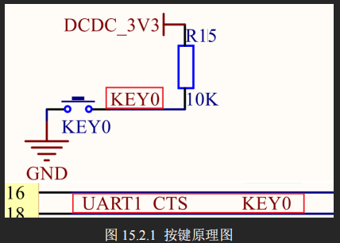
## 3.4 clk
默认配置下 I.MX6U 工作频率为 396MHz。
I.MX6U 系列**标准**的工作频率为 **528MHz**，有些型号甚至可以工作到 696MHz。
**参考**：
Chapter 10 Clock and Power Management
Chapter 18 Clock Controller Module (CCM)
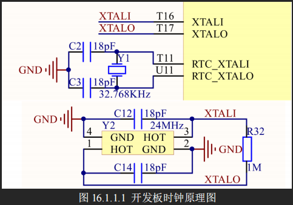
系统时钟来源于两部分：32.768KHz 和 24MHz 的晶振，其中 **32.768KHz 晶振**是 I.MX6U 的 **RTC 时钟源**，**24MHz 晶振**是 I.MX6U 内核和其它**外设的时钟源**。
### 3.4.1 7路PLL时钟源
这 7 组时钟源都是从 24MHz 晶振 PLL 而来的。
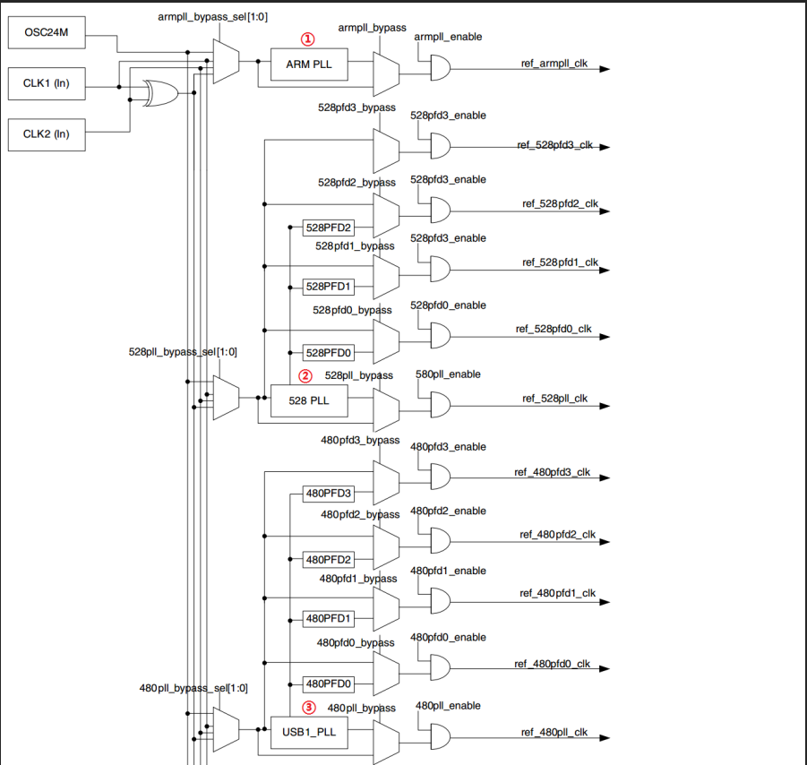
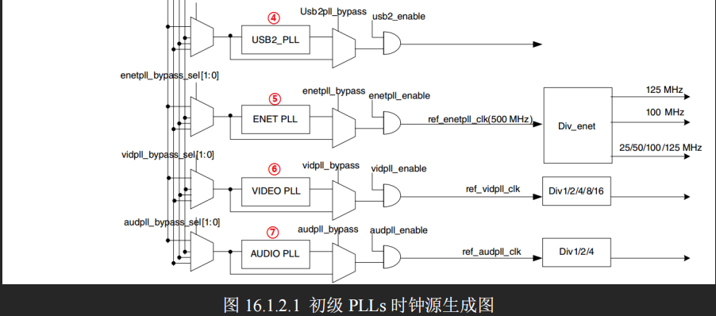
| 时钟 | 说明 |
| ---- | ---- |
| **①、ARM_PLL（PLL1）**| 此路 PLL **是供 ARM 内核使用的**，ARM 内核时钟就是由此 PLL 生成的，此 PLL 通过编程的方式**最高可倍频到 1.3GHz**。|
| **②、528_PLL(PLL2)** | 此路 PLL 也叫做 **System_PLL**，此路 PLL 是**固定的 22 倍频**，不可编程修改。此路 PLL 时钟=24MHz * 22 = **528MHz**。此 PLL **分出了 4 路 PFD**，分别为：LL2_PFD0~PLL2_PFD3。这 4 路 PFD 是 I.MX6U **内部系统总线的时钟源**，比如内处理逻辑单元、DDR 接口、NAND/NOR 接口等等。|
| **③、USB1_PLL(PLL3)** | 此路 PLL **主要用于 USBPHY**，此 PLL 也有**四路 PFD**，为：PLL3_PFD0~PLL3_PFD3，USB1_PLL 是**固定的 20 倍频**，因此 USB1_PLL=24MHz *20=**480MHz**。USB1_PLL虽然主要用于USB1PHY，但是其和四路PFD同样也**可以作为其他外设的根时钟源**。|
| **④、USB2_PLL(PLL7)** | 看名字就知道此路PLL是**给USB2PHY使用的**。同样的，此路PLL**固定为20倍频，因此也是480MHz**。|
| **⑤、ENET_PLL(PLL6)** | 此路 PLL **固定为 20+5/6 倍频**，因此 ENET_PLL=24MHz * (20+5/6) = 500MHz。此路 PLL **用于生成网络所需的时钟**，可以在此 PLL 的基础上生成 25/50/100/125MHz 的网络时钟。|
| **⑥、VIDEO_PLL(PLL5)** | 此路 PLL **用于显示相关的外设**，比如 LCD，此路 PLL 的倍频可以调整，PLL 的输出范围在 **650MHz~1300MHz**。此路 PLL 在最终输出的时候还可以进行分频，可选 1/2/4/8/16 分频。|
| **⑦、AUDIO_PLL(PLL4)** | 此路 PLL **用于音频相关的外设**，此路 PLL 的倍频可以调整，PLL 的输出范围同样也是 **650MHz~1300MHz**，此路 PLL 在最终输出的时候也可以进行分频，可选 1/2/4 分频。|
### 3.4.2 时钟树
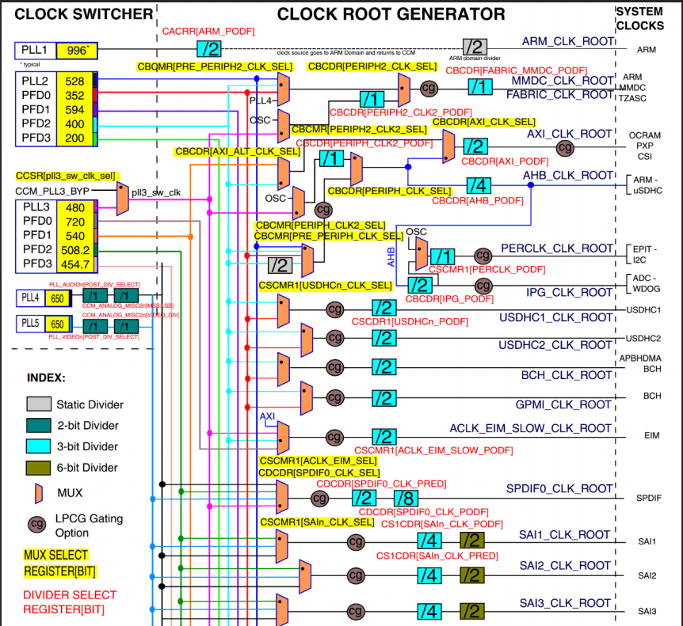
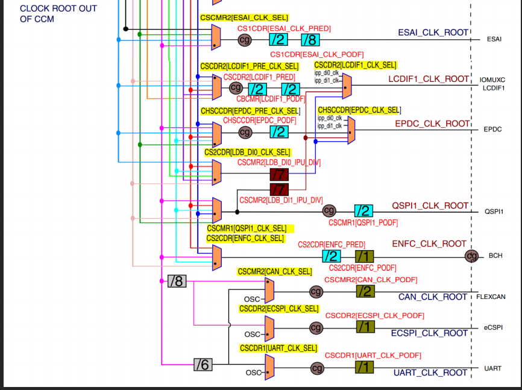
### 3.4.3 ARM 频率设置
①、内核时钟源来自于 PLL1，假如此时 PLL1 为 996MHz。
②、通过寄存器 CCM_CACRR 的 ARM_PODF 位对 PLL1 进行分频，可选择 1/2/4/8 分频，996/2=498MHz。
③、经过第②步 2 分频以后的 498MHz 就是 ARM 的内核时钟。
### 3.4.4 CCM_CACRR 寄存器的 ARM_PODF
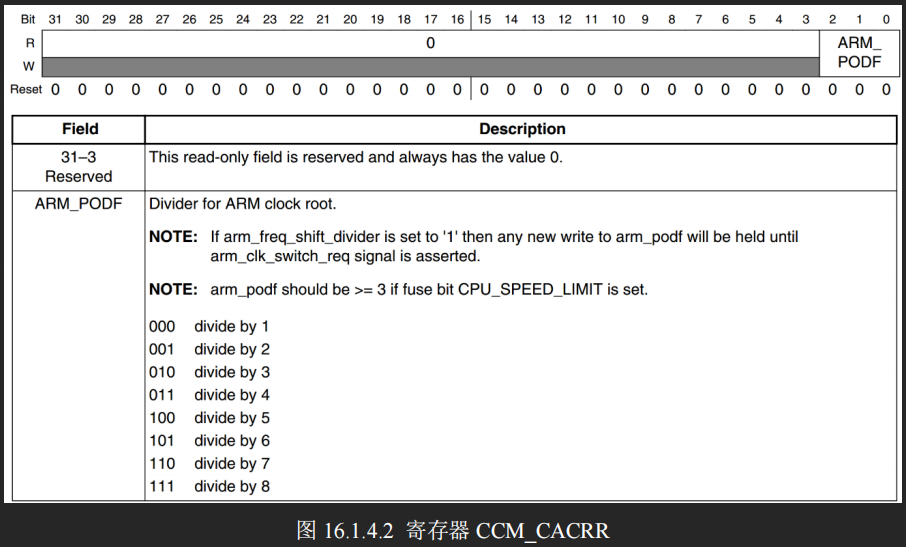
可以设置为 0~7，分别对应 1~8 分频。
### 3.4.5 CCM_ANALOG_PLL_ARMn 寄存器
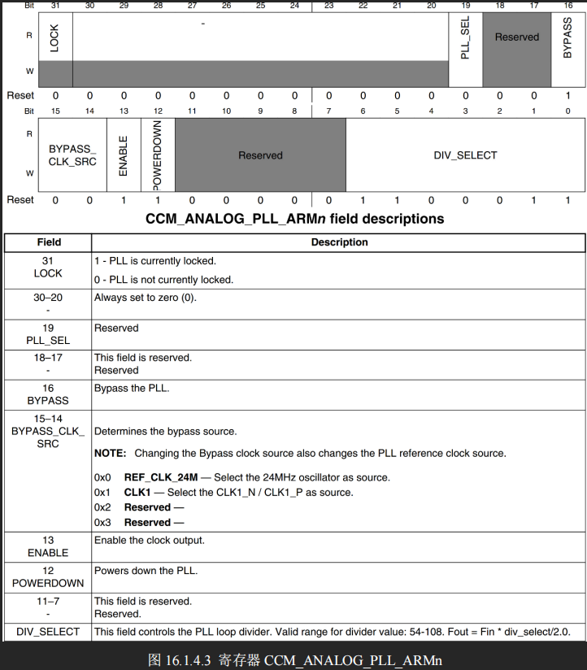
**ENABLE:** PLL1 时钟输出使能位。
**DIV_SELECT:** 此位设置 PLL1 的输出频率，可设置范围为：54~108，PLL1 CLK = Fin *
div_seclec/2.0，Fin=24MHz。如果 PLL1 要输出 1056MHz 的话，div_select 就要设置为 88。
**在修改 PLL1 时钟频率的时候我们需要先将内核时钟源改为其他的时钟**，可选
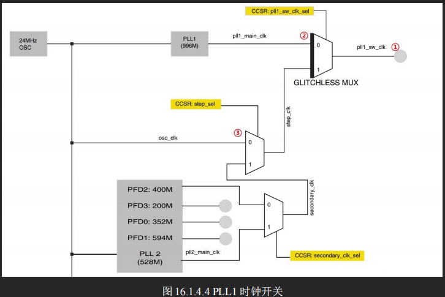
①、pll1_sw_clk 也就是 PLL1 的最终输出频率。
②、选择器选择 pll1_sw_clk 的时钟源，由寄存器 CCM_CCSR 的 PLL1_SW_CLK_SEL 位决定选择 pll1_main_clk 还是 step_clk。
③、选择器选择 step_clk 的时钟源，由寄存器 CCM_CCSR 的 STEP_SEL 位
来决定选择 osc_clk 还是 secondary_clk。一般选择 osc_clk，也就是 24MHz 的晶振。
### 3.4.6 CCM_CCSR 寄存器
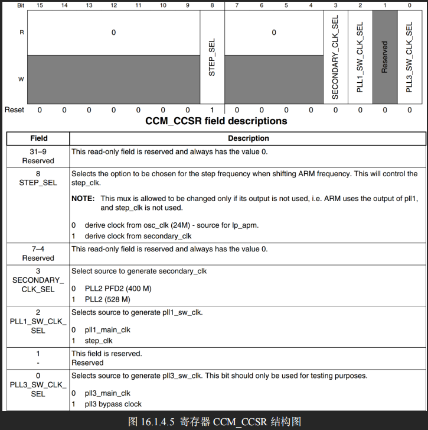
只用到了 **STEP_SEL、PLL1_SW_CLK_SEL** 这两个位，一个是用来选择 step_clk 时钟源的，一个是用来选择 pll1_sw_clk 时钟源的。
### 3.4.7 设置IMX6UL主频的步骤
1) 设置寄存器 CCSR 的 STEP_SEL 位，设置 **step_clk** 的时钟源为 24M 的晶振。
2) 设置寄存器 CCSR 的 PLL1_SW_CLK_SEL 位，设置 **pll1_sw_clk** 的时钟源为 step_clk=24MHz。
3) 设置寄存器 CCM_ANALOG_PLL_ARMn，将 pll1_main_clk(PLL1)设置为 1056MHz。
4) 设置寄存器 CCSR 的 PLL1_SW_CLK_SEL 位，**重新将 pll1_sw_clk 的时钟源切换回
pll1_main_clk**，切换回来以后的 pll1_sw_clk 就等于 1056MHz。
5) 后设置寄存器 **CCM_CACRR 的 ARM_PODF 为 2 分频**，I.MX6U 的内核主频就为
1056/2=528MHz。
### 3.4.8 PFD时钟设置
PLL2、PLL3 和 PLL7 固定为 528MHz、480MHz 和 480MHz，PLL4~PLL6 都是针对特殊外设
的，用到的时候再设置。下来重点就是设置 PLL2 和 PLL3 的各自 4 路 PFD，推荐设置：
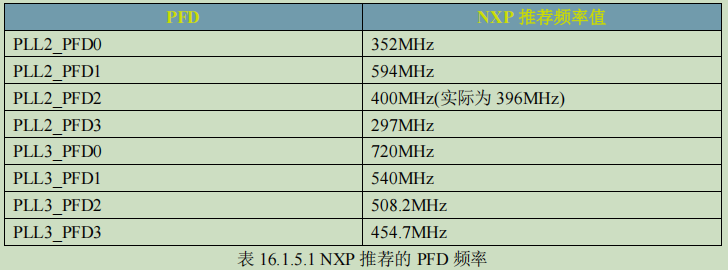
#### 3.4.8.1 设置 PLL2 的 4 路 PFD 频率设置寄存器 CCM_ANALOG_PFD_528n
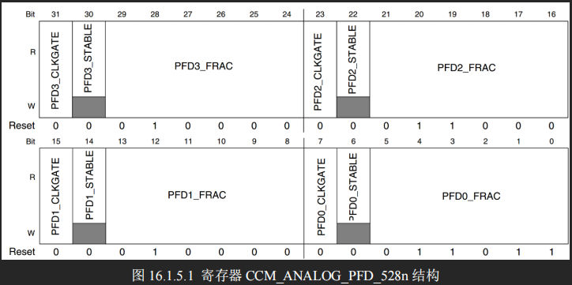
分为四组，分别对应 PFD0~PFD3，以 PFD0 为例：
**PFD0_FRAC:** PLL2_PFD0 的分频数，PLL2_PFD0 的计算公式为 528*18/PFD0_FRAC，此为可设置的范围为 12~35 。 如 果 PLL2_PFD0 的频率要设置为 352MHz 的话 PFD0_FRAC=528*18/352=27。
**PFD0_STABLE:** 此位为只读位，可以通过读取此位**判断 PLL2_PFD0 是否稳定**。
**PFD0_CLKGATE:** PLL2_PFD0 **输出使能位**，为 1 的时候关闭 PLL2_PFD0 的输出，**为 0 的时候使能输出**。
| PLL2 PFDx | PFDx_FRAC | PFDx_CLKGATE | freq=528*18/PFDX_FRAC(X=1~3) |
| ---- | --- | --- | --- |
| PFD0 | 27 | 0 | 352MHz |
| PFD1 | 16 | 0 | 594MHz |
| PFD2 | 24 | 0 | 396MHz |
| PFD3 | 32 | 0 | 297MHz |
#### 3.4.8.2 设置 PLL3 的 4 路 PFD 频率设置寄存器 CCM_ANALOG_PFD_480n

| PLL3 PFDx | PFDx_FRAC | PFDx_CLKGATE | freq=480*18/PFDX_FRAC(X=0~3) |
| ---- | --- | --- | --- |
| PFD0 | 12 | 0 | 720MHz |
| PFD1 | 16 | 0 | 540MHz |
| PFD2 | 17 | 0 | 508.2MHz |
| PFD3 | 19 | 0 | 454.7MHz |
### 3.4.9 AHB、IPG 和 PERCLK 根时钟设置
7 路 PLL 和 8 路 PFD 设置完成以后最后还需要设置 **AHB_CLK_ROOT 和 IPG_CLK_ROOT** 的时钟。
#### 3.4.9.1 AHP 和 IPG 时钟
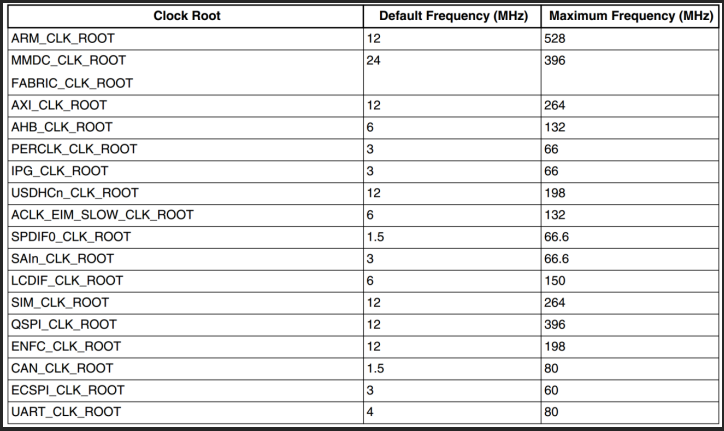
| 外设 | 时钟 |
| ---- | --- |
| AHB_CLK_ROOT | 132MHz |
| IPG_CLK_ROOT | 66MHz |
| PERCLK_CLK_ROOT | 66MHz |

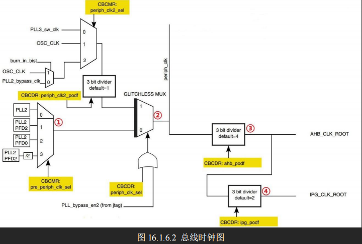
①、选择器用来**选择 pre_periph_clk 的时钟源**，可以选择 PLL2、PLL2_PFD2、PLL2_PFD0 和 PLL2_PFD2/2。寄存器 CCM_CBCMR 的 PRE_PERIPH_CLK_SEL 位决定选择哪一个，默认选择 PLL2_PFD2，因此 pre_periph_clk=PLL2_PFD2=396MHz。
②、选择器用来**选择 periph_clk 的时钟源**，由寄存器 CCM_CBCDR 的 PERIPH_CLK_SEL 位与 PLL_bypass_en2 组成的或来选择。当 CCM_CBCDR 的 PERIPH_CLK_SEL 位为 0 的时候 periph_clk=pr_periph_clk=396MHz。
③、通过 CBCDR 的 AHB_PODF 位来**设置 AHB_CLK_ROOT 的分频值**，可以设置 1~8 分频，如果想要 AHB_CLK_ROOT=132MHz 的话就应该设置为 3 分频：396/3=132MHz。图中虽然写的是默认 4 分频，但是 I.MX6U 的内部 boot rom 将其改为了 3 分频！
④、通过 CBCDR 的 IPG_PODF 位来**设置 IPG_CLK_ROOT 的分频值**，可以设置 1~4 分频，IPG_CLK_ROOT 时钟源是 AHB_CLK_ROOT，要想 IPG_CLK_ROOT=66MHz 的话就应该设置2 分频：132/2=66MHz。
#### 3.4.9.2 PERCLK_CLK_ROOT 时钟
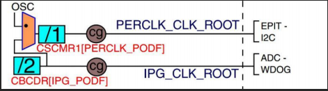
， PERCLK_CLK_ROOT 来 源 有 两 种 ： **OSC(24MHz) 和 IPG_CLK_ROOT**，由**寄存器 CCM_CSCMR1 的 PERCLK_CLK_SEL 位来决定**，如果为 0 的话PERCLK_CLK_ROOT 的时钟源就是 IPG_CLK_ROOT=66MHz 。可以通过寄存器 CCM_CSCMR1 的 PERCLK_PODF 位来设置分频，如果要设置 PERCLK_CLK_ROOT 为 66MHz 的话就要设置为 1 分频。
#### 3.4.9.3 CCM_CBCDR 寄存器
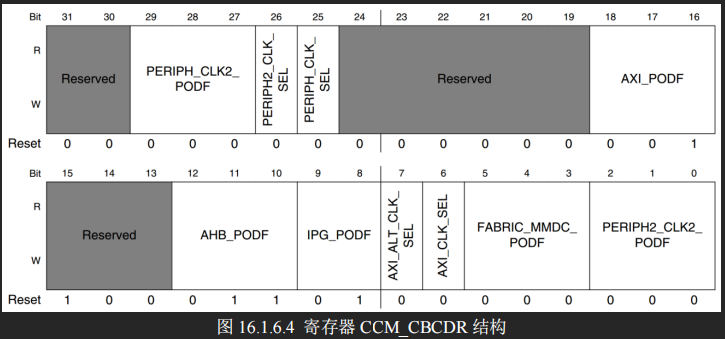
**PERIPH_CLK2_PODF**：periph2 时钟分频，可设置 0~7，分别对应 1~8 分频。
**PERIPH2_CLK_SEL**：选择 peripheral2 的主时钟，如果为 0 的话选择 PLL2，如果为 1 的话选择 periph2_clk2_clk。修改此位会引起一次与 MMDC 的握手，所以修改完成以后要等待握手完成，握手完成信号由寄存器 CCM_CDHIPR 中指定位表示。
**PERIPH_CLK_SEL**：peripheral 主时钟选择，如果为 0 的话选择 PLL2，如果为 1 的话选择 periph_clk2_clock。修改此位会引起一次与 MMDC 的握手，所以修改完成以后要等待握手完成，握手完成信号由寄存器 CCM_CDHIPR 中指定位表示。
**AXI_PODF**：axi 时钟分频，可设置 0~7，分别对应 1~8 分频。
**AHB_PODF**：ahb 时钟分频，可设置 0~7，分别对应 1~8 分频。修改此位会引起一次与 MMDC 的握手，所以修改完成以后要等待握手完成，握手完成信号由寄存器 CCM_CDHIPR 中指定位表示。
**IPG_PODF**：ipg 时钟分频，可设置 0~3，分别对应 1~4 分频。
**AXI_ALT_CLK_SEL**：axi_alt 时钟选择，为 0 的话选择 PLL2_PFD2，如果为 1 的话选择 PLL3_PFD1。
**AXI_CLK_SEL**：axi 时钟源选择，为 0 的话选择 periph_clk，为 1 的话选择 axi_alt 时钟。
**FABRIC_MMDC_PODF**：fabric/mmdc 时钟分频设置，可设置 0~7，分别对应 1~8 分频。
**PERIPH2_CLK2_PODF**：periph2_clk2 的时钟分频，可设置 0~7，分别对应 1~8 分频。
#### 3.4.9.4 CCM_CBCMR 寄存器
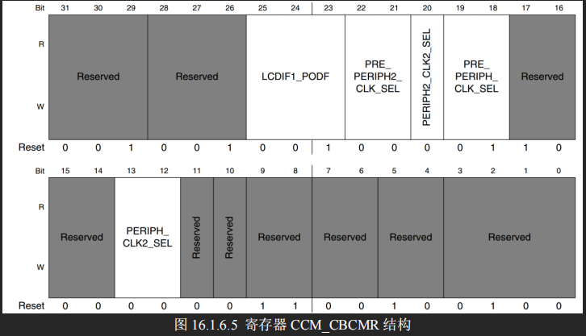
**LCDIF1_PODF**：lcdif1 的时钟分频，可设置 0~7，分别对应 1~8 分频。
**PRE_PERIPH2_CLK_SEL**：pre_periph2 时钟源选择，00 选择 PLL2，01 选择 PLL2_PFD2，10 选择 PLL2_PFD0，11 选择 PLL4。
**PERIPH2_CLK2_SEL**：periph2_clk2 时钟源选择为 0 的时候选择 pll3_sw_clk，为 1 的时候选择 OSC。
**PRE_PERIPH_CLK_SEL**：pre_periph 时钟源选择，00 选择 PLL2，01 选择 PLL2_PFD2，10 选择 PLL2_PFD0，11 选择 PLL2_PFD2/2。
**PERIPH_CLK2_SEL**：peripheral_clk2 时钟源选择，00 选择 pll3_sw_clk，01 选择 osc_clk，10 选择 pll2_bypass_clk。
#### 3.4.9.5 CCM_CSCMR1 寄存器
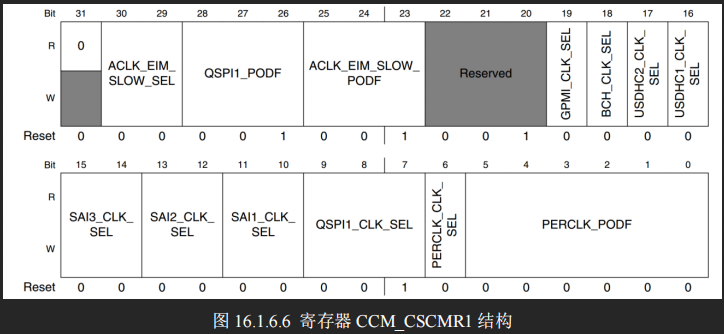
主要用于外设时钟源的选择:
**PERCLK_CK_SEL**：perclk 时钟源选择，为 0 的话选择 ipg clk，为 1 的话选择 osc clk。
**PERCLK_PODF**：perclk 的时钟分频，可设置 0~7，分别对应 1~8 分频。
在修改如下时钟选择器或者分频器的时候会引起与 MMDC 的握手发生：
①、mmdc_podf
②、periph_clk_sel
③、periph2_clk_sel
④、arm_podf
⑤、ahb_podf
发生握手信号以后需要等待握手完成，寄存器 CCM_CDHIPR 中保存着握手信号是否完成，如果相应的位为 1 的话就表示握手没有完成，如果为 0 的话就表示握手完成，很简单，这里就不详细的列举寄存器 CCM_CDHIPR 中的各个位了。
另外在修改 arm_podf 和 ahb_podf 的时候需要先关闭其时钟输出，等修改完成以后再打开，否则的话可能会出现在修改完成以后没有时钟输出的问题。本教程需要修改寄存器 CCM_CBCDR 的 AHB_PODF 位来设置 AHB_ROOT_CLK 的时钟，所以在修改之前必须先关闭 AHB_ROOT_CLK 的输出。但是笔者没有找到相应的寄存器，因此目前没法关闭，那也就没法设置 AHB_PODF 了。不过 AHB_PODF 内部 boot rom 设置为了 3 分频，如果 pre_periph_clk 的时钟源选择 PLL2_PFD2 的话，AHB_ROOT_CLK 也是 396MHz/3=132MHz。

## 3.5 GPIO 中断